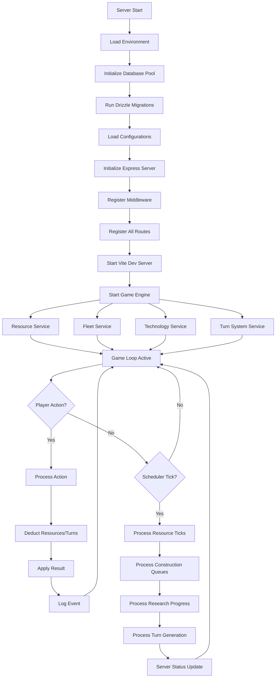
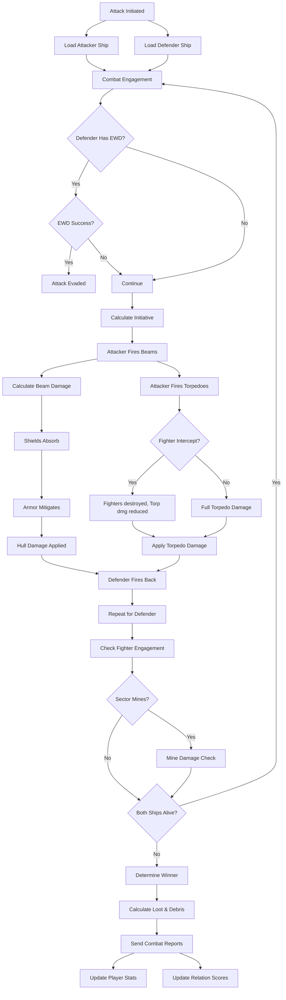
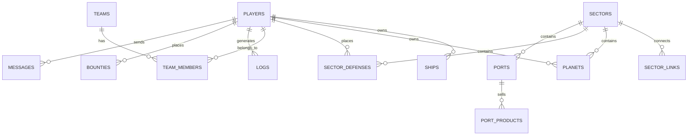

# Stellar Dominion - Complete UML Architecture & Design Document

> **Stellar Dominion** — A Next-Generation 4X Space Strategy MMORPG (TypeScript/React/PostgreSQL)
> **Xenobe Rage / Blacknova Traders** — The Classic PHP Foundation (2001-2013)
> Repository: https://github.com/ArkansasIo/stellar-dominion3.git
> Xenobe Rage Source: https://github.com/ArkansasIo/xenoberage.git

---

## Table of Contents

1. [System Overview](#1-system-overview)
2. [Dual-Architecture Evolution](#2-dual-architecture-evolution)
3. [Stellar Dominion 5-Layer Framework](#3-stellar-dominion-5-layer-framework)
4. [Xenobe Rage 4-Layer Framework](#4-xenobe-rage-4-layer-framework)
5. [Complete Stellar Dominion Package Structure](#5-complete-stellar-dominion-package-structure)
6. [Server Routes & API Map](#6-server-routes--api-map)
7. [Database Schema (PostgreSQL - Drizzle ORM)](#7-database-schema)
8. [Core Services Diagram](#8-core-services-diagram)
9. [Game Engine Flow](#9-game-engine-flow)
10. [Turn System UML](#10-turn-system-uml)
11. [Combat System UML](#11-combat-system-uml)
12. [Resource & Economy System](#12-resource--economy-system)
13. [Research & Technology Tree](#13-research--technology-tree)
14. [Fleet & Unit Systems](#14-fleet--unit-systems)
15. [Planet & Colonization System](#15-planet--colonization-system)
16. [Trading & Banking System](#16-trading--banking-system)
17. [Expedition System](#17-expedition-system)
18. [Xenobe AI System (Legacy)](#18-xenobe-ai-system)
19. [Scheduler System (Legacy)](#19-scheduler-system)
20. [Frontend Component Architecture](#20-frontend-component-architecture)
21. [Entity Relationship Diagrams](#21-entity-relationship-diagrams)
22. [Authentication & Security Flow](#22-authentication--security-flow)
23. [State Management Strategy](#23-state-management-strategy)
24. [Deployment Architecture](#24-deployment-architecture)
25. [Configuration Constants Reference](#25-configuration-constants-reference)

---

## 1. System Overview

### Stellar Dominion Architecture (Node.js/TypeScript)

```
┌─────────────────────────────────────────────────────────────────────────┐
│                      STELLAR DOMINION SYSTEM                            │
│                5-Layer Space Strategy MMORPG Framework                   │
├─────────────────────────────────────────────────────────────────────────┤
│                                                                         │
│  ┌─────────────────────────────────────────────────────────────────┐   │
│  │               LAYER 1: MMORPG CHARACTER PROGRESSION             │   │
│  │  [Levels 1-999] [Tiers 1-99] [Prestige] [XP System]            │   │
│  │  [Commander Skills] [Government Tree] [Achievements]            │   │
│  └─────────────────────────────────────────────────────────────────┘   │
│                                    │                                    │
│  ┌─────────────────────────────────────────────────────────────────┐   │
│  │               LAYER 2: 4X EMPIRE MANAGEMENT                    │   │
│  │  [Resource Economy] [Technology Tree] [Colonies/Planets]       │   │
│  │  [Buildings] [Diplomacy/Alliances] [Currency & Market]         │   │
│  └─────────────────────────────────────────────────────────────────┘   │
│                                    │                                    │
│  ┌─────────────────────────────────────────────────────────────────┐   │
│  │               LAYER 3: RTS FLEET BATTLES                       │   │
│  │  [60+ Unit Types] [Fleet Management] [Shipyard]                │   │
│  │  [Construction Queue] [Commander Bonuses] [Formations]         │   │
│  └─────────────────────────────────────────────────────────────────┘   │
│                                    │                                    │
│  ┌─────────────────────────────────────────────────────────────────┐   │
│  │               LAYER 4: TURN-BASED TACTICAL COMBAT              │   │
│  │  [6 Turns/Min] [Combat Rounds] [Damage Calc] [Formations]      │   │
│  │  [Armor/Shields/Hull] [Critical Hits] [Evasion] [Morale]       │   │
│  └─────────────────────────────────────────────────────────────────┘   │
│                                    │                                    │
│  ┌─────────────────────────────────────────────────────────────────┐   │
│  │               LAYER 5: PERSISTENT MMO GALAXY                   │   │
│  │  [3D Star Systems] [Expeditions] [Enemy AI] [Relationships]    │   │
│  │  [Multi-Player Events] [Faction Wars] [Territory Control]      │   │
│  └─────────────────────────────────────────────────────────────────┘   │
│                                                                         │
│  ┌─────────────────┐  ┌──────────────────┐  ┌──────────────────────┐   │
│  │  React Frontend │  │  Express API     │  │  PostgreSQL Database │   │
│  │  (53 Pages)     │  │  (60+ Routes)    │  │  (30+ Tables)        │   │
│  └─────────────────┘  └──────────────────┘  └──────────────────────┘   │
│                                                                         │
└─────────────────────────────────────────────────────────────────────────┘
```

---

## 2. Dual-Architecture Evolution

```
┌─────────────────────────────────────────────────────────────────────────┐
│                  ARCHITECTURE EVOLUTION                                  │
├─────────────────────────────────────────────────────────────────────────┤
│                                                                         │
│  2001 ─── BNT (Blacknova Traders)                                      │
│            ├─ PHP 4/5 Procedural                                        │
│            ├─ MySQL Database                                            │
│            ├─ ADOdb Database Abstraction                                │
│            └─ Basic HTML/CSS Templates                                  │
│                  │                                                      │
│                  ▼                                                      │
│  2013 ─── Xenobe Rage (Fork)                                           │
│            ├─ PHP 5.3+ (OO Classes)                                     │
│            ├─ PDO Database Singleton                                    │
│            ├─ SPL Autoloader                                            │
│            ├─ CRUD Manager Classes                                      │
│            └─ Facebook Integration                                      │
│                  │                                                      │
│                  ▼                                                      │
│  2024 ─── Stellar Dominion (Rewrite)                                    │
│            ├─ TypeScript Full-Stack                                     │
│            ├─ React 19 + Vite + TailwindCSS                             │
│            ├─ Node.js + Express.js                                      │
│            ├─ PostgreSQL + Drizzle ORM                                  │
│            ├─ Drizzle-Zod Validation                                   │
│            ├─ React Query Server State                                  │
│            └─ Wouter Routing                                            │
│                                                                         │
└─────────────────────────────────────────────────────────────────────────┘
```

---

## 3. Stellar Dominion 5-Layer Framework

### Layer 1: MMORPG Character Progression

```
┌─────────────────────────────────────────────────────────────────────────┐
│ LAYER 1: MMORPG CHARACTER PROGRESSION                   [SERVER-SIDE]  │
├─────────────────────────────────────────────────────────────────────────┤
│                                                                         │
│  ┌──────────────────────────────────────────────────────────────────┐   │
│  │                    LEVEL & TIER PROGRESSION                      │   │
│  │  ┌────────────────────────┐  ┌───────────────────────────────────┐│   │
│  │  │  999 Levels            │  │  99 Tiers                        ││   │
│  │  │  Exponential XP Growth │  │  Unlock at thresholds            ││   │
│  │  │  Multipliers: 1→10.98x │  │  Tier Multipliers: 1→5.9x       ││   │
│  │  │  Combined: 1→64.8x     │  │                                  ││   │
│  │  └────────────────────────┘  └───────────────────────────────────┘│   │
│  └──────────────────────────────────────────────────────────────────┘   │
│                                                                         │
│  ┌──────────────────────────────────────────────────────────────────┐   │
│  │                    UNIVERSAL STAT SYSTEM                         │   │
│  │  ┌────────────────────────────────────────────────────────────┐  │   │
│  │  │  Base Stats (4)            │  Sub Stats (4)                │  │   │
│  │  │  ├─ Power                  │  ├─ Precision                  │  │   │
│  │  │  ├─ Defense               │  ├─ Endurance                 │  │   │
│  │  │  ├─ Mobility              │  ├─ Efficiency                │  │   │
│  │  │  └─ Utility               │  └─ Control                   │  │   │
│  │  ├────────────────────────────┼───────────────────────────────┤  │   │
│  │  │  Attributes (4)            │  Sub Attributes (4)           │  │   │
│  │  │  ├─ Tech                  │  ├─ Sensor Range              │  │   │
│  │  │  ├─ Command               │  ├─ Energy Use               │  │   │
│  │  │  ├─ Logistics             │  ├─ Maintenance              │  │   │
│  │  │  └─ Survivability         │  └─ Adaptation               │  │   │
│  │  └────────────────────────────────────────────────────────────┘  │   │
│  └──────────────────────────────────────────────────────────────────┘   │
│                                                                         │
│  ┌──────────────────────────────────────────────────────────────────┐   │
│  │                    COMMANDER SYSTEM                              │   │
│  │  ├─ Combat Experience (0-999)                                    │   │
│  │  ├─ Tactics Skill (1-99 tiers)                                  │   │
│  │  ├─ Class Bonuses (5+ classes)                                  │   │
│  │  ├─ Skill Tree (commanderSkillTreeSystem.ts)                    │   │
│  │  ├─ Talent Tree (commanderTalentTree.ts)                       │   │
│  │  └─ Fleet Multipliers (1.0-3.0x)                               │   │
│  └──────────────────────────────────────────────────────────────────┘   │
│                                                                         │
│  ┌──────────────────────────────────────────────────────────────────┐   │
│  │                    GOVERNMENT SYSTEM                             │   │
│  │  ├─ Government Progression Tree (governmentProgressionTree.ts)   │   │
│  │  ├─ Government Building Structures (governmentBuildings.ts)      │   │
│  │  ├─ Government Leaders (governmentLeaders.ts)                    │   │
│  │  └─ Civilization System (civilizationSystemService.ts)           │   │
│  └──────────────────────────────────────────────────────────────────┘   │
│                                                                         │
│  ┌──────────────────────────────────────────────────────────────────┐   │
│  │                    KNOWLEDGE SYSTEM                              │   │
│  │  ├─ 10 Knowledge Types                                           │   │
│  │  ├─ 4 Classes per Type                                          │   │
│  │  ├─ 5 Tiers per Class                                           │   │
│  │  ├─ 2000+ Mastery Points                                        │   │
│  │  └─ Synergy Bonuses                                             │   │
│  └──────────────────────────────────────────────────────────────────┘   │
│                                                                         │
│  ┌──────────────────────────────────────────────────────────────────┐   │
│  │                    ACHIEVEMENTS & PRESTIGE                       │   │
│  │  ├─ 200+ Achievements (6 categories)                             │   │
│  │  ├─ Prestige Levels (hard reset, permanent multipliers)          │   │
│  │  ├─ Prestige Bonuses: Resource, XP, Research mults              │   │
│  │  └─ Badges & Milestone Rewards                                  │   │
│  └──────────────────────────────────────────────────────────────────┘   │
│                                                                         │
└─────────────────────────────────────────────────────────────────────────┘
```

### Layer 2: 4X Empire Management

```
┌─────────────────────────────────────────────────────────────────────────┐
│ LAYER 2: 4X EMPIRE MANAGEMENT                           [CLIENT+SERVER] │
├─────────────────────────────────────────────────────────────────────────┤
│                                                                         │
│  ┌──────────────────────────────────────────────────────────────────┐   │
│  │                    RESOURCE ECONOMY                             │   │
│  │  ┌──────────┐ ┌───────────┐ ┌──────────┐ ┌───────────┐         │   │
│  │  │  Metal   │ │  Crystal  │ │Deuterium │ │  Energy   │         │   │
│  │  │(primary) │ │ (tech)   │ │ (fuel)    │ │ (power)   │         │   │
│  │  └──────────┘ └───────────┘ └──────────┘ └───────────┘         │   │
│  │  ┌──────────┐ ┌───────────┐ ┌──────────┐ ┌───────────┐         │   │
│  │  │ Credits  │ │   Food    │ │  Water   │ │Population │         │   │
│  │  └──────────┘ └───────────┘ └──────────┘ └───────────┘         │   │
│  │  Production Multipliers from Level/Tier Prestige                │   │
│  └──────────────────────────────────────────────────────────────────┘   │
│                                                                         │
│  ┌──────────────────────────────────────────────────────────────────┐   │
│  │                    TECHNOLOGY TREE                              │   │
│  │  ├─ Physics (9 techs)   ├─ Warp Drive    ├─ Weapons Systems     │   │
│  │  ├─ Society (8 techs)   ├─ AI Research   ├─ Biotechnology       │   │
│  │  ├─ Engineering (8)     ├─ Materials     ├─ Production          │   │
│  │  ├─ Prerequisites       ├─ Dependencies  └─ Unlock Progression  │   │
│  │  └─ Research Queue System (queue, history, bonuses)              │   │
│  └──────────────────────────────────────────────────────────────────┘   │
│                                                                         │
│  ┌──────────────────────────────────────────────────────────────────┐   │
│  │                    COLONIES & PLANETS                            │   │
│  │  ├─ Planet Types: Terran, Rocky, Gas, Barren, Desert, Water     │   │
│  │  ├─ Colony Types: Resource, Research, Military, Industrial      │   │
│  │  ├─ Orbital Buildings: Stations, Shipyards, Research Labs       │   │
│  │  ├─ Moon Bases: Mining, Research, Military                      │   │
│  │  ├─ Starbases: Mining, Refining, Shipyard, Research, Trade      │   │
│  │  └─ Mega Structures: Dyson Sphere, Ring World, Matrioshka Brain │   │
│  └──────────────────────────────────────────────────────────────────┘   │
│                                                                         │
│  ┌──────────────────────────────────────────────────────────────────┐   │
│  │                    DIPLOMACY & ALLIANCES                        │   │
│  │  ├─ Alliance Management (create, join, leave)                    │   │
│  │  ├─ Diplomatic Relations (trade, non-aggression, war)            │   │
│  │  ├─ Trade Routes                                                 │   │
│  │  ├─ Shared Resources & Territory                                 │   │
│  │  └─ Guild System                                                 │   │
│  └──────────────────────────────────────────────────────────────────┘   │
│                                                                         │
│  ┌──────────────────────────────────────────────────────────────────┐   │
│  │                    BUILDINGS (15+ Types)                         │   │
│  │  ├─ Resource: Metal Mine, Crystal Mine, Deuterium Plant         │   │
│  │  ├─ Energy: Solar Plant, Fusion Reactor                         │   │
│  │  ├─ Production: Robotics Factory, Shipyard                      │   │
│  │  ├─ Research: Research Lab, Tech Center                         │   │
│  │  ├─ Defense: Shield Dome, Planetary Cannon, Missile Battery     │   │
│  │  ├─ Civilian: Hydroponics, Medical Center, Bank, Factory        │   │
│  │  └─ Special: Constructor Yard, Custom Lab, Orbital Station      │   │
│  └──────────────────────────────────────────────────────────────────┘   │
│                                                                         │
└─────────────────────────────────────────────────────────────────────────┘
```

### Layer 3: RTS Fleet Battles

```
┌─────────────────────────────────────────────────────────────────────────┐
│ LAYER 3: RTS FLEET BATTLES                              [CLIENT+SERVER] │
├─────────────────────────────────────────────────────────────────────────┤
│                                                                         │
│  ┌──────────────────────────────────────────────────────────────────┐   │
│  │                    60+ UNITS ACROSS 8 CATEGORIES                │   │
│  │  ┌────────────────────────────────────────────────────────────┐  │   │
│  │  │ Combat Ships:                                               │  │   │
│  │  │  Scout, Fighter, Cruiser, Battleship, Carrier, Destroyer,   │  │   │
│  │  │  Corvette, Frigate, Titan, Flagship                         │  │   │
│  │  ├────────────────────────────────────────────────────────────┤  │   │
│  │  │ Motherships:                                                │  │   │
│  │  │  Command, Factory, Hospital, Colony, Harvester              │  │   │
│  │  ├────────────────────────────────────────────────────────────┤  │   │
│  │  │ Troops:                                                     │  │   │
│  │  │  Infantry, Heavy, Special Forces, Sniper, Medic, Engineer   │  │   │
│  │  ├────────────────────────────────────────────────────────────┤  │   │
│  │  │ Vehicles:                                                   │  │   │
│  │  │  Tank, Artillery, Mech, Drone, Walker, Gunship              │  │   │
│  │  ├────────────────────────────────────────────────────────────┤  │   │
│  │  │ Civilians: Worker, Scientist, Trader, Diplomat, Colonist   │  │   │
│  │  └────────────────────────────────────────────────────────────┘  │   │
│  └──────────────────────────────────────────────────────────────────┘   │
│                                                                         │
│  ┌──────────────────────────────────────────────────────────────────┐   │
│  │                    FLEET MANAGEMENT                             │   │
│  │  ├─ Build Queue                                                │   │
│  │  ├─ Fleet Power Calculation                                     │   │
│  │  ├─ Resource Costs                                              │   │
│  │  ├─ Shipyard Production                                         │   │
│  │  ├─ Hangar Slots                                                │   │
│  │  └─ Commander Assignment                                        │   │
│  └──────────────────────────────────────────────────────────────────┘   │
│                                                                         │
│  ┌──────────────────────────────────────────────────────────────────┐   │
│  │                    EQUIPMENT & DURABILITY                        │   │
│  │  ├─ Equipment Loadout System                                     │   │
│  │  ├─ Equipment Tempering / Upgrading                              │   │
│  │  ├─ Durability Tracking (equipment, fleet, building)             │   │
│  │  ├─ Repair System (gold, platinum, resources)                    │   │
│  │  └─ Degradation Logs                                             │   │
│  └──────────────────────────────────────────────────────────────────┘   │
│                                                                         │
└─────────────────────────────────────────────────────────────────────────┘
```

### Layer 4: Turn-Based Tactical Combat

```
┌─────────────────────────────────────────────────────────────────────────┐
│ LAYER 4: TURN-BASED TACTICAL COMBUT                    [SERVER + CLIENT]│
├─────────────────────────────────────────────────────────────────────────┤
│                                                                         │
│  ┌──────────────────────────────────────────────────────────────────┐   │
│  │                    TURN SYSTEM (6 turns/minute)                  │   │
│  │  ├─ Turn Generation (offline accrual)                            │   │
│  │  ├─ Turn Consumption (1 turn = 1 action)                         │   │
│  │  ├─ Research Progression by Turns                                │   │
│  │  ├─ Offline Accumulation (capped)                                │   │
│  │  └─ Atomic Operations                                            │   │
│  └──────────────────────────────────────────────────────────────────┘   │
│                                                                         │
│  ┌──────────────────────────────────────────────────────────────────┐   │
│  │                    COMBAT ROUNDS (Max 6)                         │   │
│  │  ├─ Target Selection                                             │   │
│  │  ├─ Attack Resolution                                            │   │
│  │  ├─ Shield → Armor → Hull Damage Chain                           │   │
│  │  ├─ Special Actions: Repair, Rally, Flee                         │   │
│  │  └─ Round Logging                                                │   │
│  └──────────────────────────────────────────────────────────────────┘   │
│                                                                         │
│  ┌──────────────────────────────────────────────────────────────────┐   │
│  │                    DAMAGE CALCULATION                            │   │
│  │  ├─ Weapon Calculation                                           │   │
│  │  ├─ Armor Penetration                                            │   │
│  │  ├─ Critical Hits                                                │   │
│  │  ├─ Evasion Mechanics                                            │   │
│  │  ├─ Fighter Interception                                         │   │
│  │  └─ Torpedo Damage with Interceptors                             │   │
│  └──────────────────────────────────────────────────────────────────┘   │
│                                                                         │
│  ┌──────────────────────────────────────────────────────────────────┐   │
│  │                    FORMATION TACTICS                             │   │
│  │  ├─ Front / Middle / Back Line Positioning                       │   │
│  │  ├─ Morale Impact                                                │   │
│  │  ├─ Tactical Bonuses                                             │   │
│  │  └─ Combat Formations: Balanced, Aggressive, Defensive, Flank    │   │
│  └──────────────────────────────────────────────────────────────────┘   │
│                                                                         │
│  ┌──────────────────────────────────────────────────────────────────┐   │
│  │                    COMBAT REPORTS                                │   │
│  │  ├─ Battle Logs (round-by-round)                                 │   │
│  │  ├─ Victory Conditions                                           │   │
│  │  ├─ Loot Calculation                                             │   │
│  │  ├─ Debris Field Generation                                      │   │
│  │  └─ Casualty Tracking                                            │   │
│  └──────────────────────────────────────────────────────────────────┘   │
│                                                                         │
└─────────────────────────────────────────────────────────────────────────┘
```

### Layer 5: Persistent MMO Galaxy

```
┌─────────────────────────────────────────────────────────────────────────┐
│ LAYER 5: PERSISTENT MMO GALAXY SIMULATION                [BACKEND: Node]│
├─────────────────────────────────────────────────────────────────────────┤
│                                                                         │
│  ┌──────────────────────────────────────────────────────────────────┐   │
│  │                    STAR SYSTEMS (3D Coordinates)                 │   │
│  │  ├─ [X:Y:Z] Positioning                                         │   │
│  │  ├─ 5 Enemy Homeworlds                                          │   │
│  │  ├─ Player Colonies                                             │   │
│  │  ├─ Resource-Rich Planets                                       │   │
│  │  └─ Universe Generation (universeSeedService.ts)                │   │
│  └──────────────────────────────────────────────────────────────────┘   │
│                                                                         │
│  ┌──────────────────────────────────────────────────────────────────┐   │
│  │                    EXPEDITION SYSTEM                             │   │
│  │  ├─ 5 Types: Exploration, Military, Scientific, Trade, Conquest  │   │
│  │  ├─ 6+ Encounter Types                                           │   │
│  │  ├─ Fleet Composition & Troop Assignment                         │   │
│  │  ├─ Resource Rewards + XP                                        │   │
│  │  ├─ Encounter Resolution (opportunities, rewards, casualties)    │   │
│  │  └─ Expedition Teams & Roles                                     │   │
│  └──────────────────────────────────────────────────────────────────┘   │
│                                                                         │
│  ┌──────────────────────────────────────────────────────────────────┐   │
│  │                    ENEMY AI SYSTEM                               │   │
│  │  ├─ 5 Unique Races (enemyRacesConfig.ts)                         │   │
│  │  ├─ 8 Personalities                                             │   │
│  │  ├─ Dynamic Decision Making                                      │   │
│  │  ├─ Tactical Behavior                                            │   │
│  │  └─ Relationship Tracking (Player ↔ NPC)                         │   │
│  └──────────────────────────────────────────────────────────────────┘   │
│                                                                         │
│  ┌──────────────────────────────────────────────────────────────────┐   │
│  │                    RELATIONSHIP & DIPLOMACY                      │   │
│  │  ├─ Alliance Bonds (honor system)                                │   │
│  │  ├─ Economic Competition                                         │   │
│  │  ├─ Territory Control                                            │   │
│  │  ├─ Faction Wars                                                 │   │
│  │  ├─ Trade Route Conflicts                                        │   │
│  │  ├─ Resource Competition                                         │   │
│  │  └─ Collective Progression Events                                │   │
│  └──────────────────────────────────────────────────────────────────┘   │
│                                                                         │
└─────────────────────────────────────────────────────────────────────────┘
```

---

## 4. Xenobe Rage 4-Layer Framework (Legacy PHP)

```
┌─────────────────────────────────────────────────────────────────────────┐
│                    XENOBE RAGE - 4-LAYER FRAMEWORK                      │
│                   (Blacknova Traders - PHP Foundation)                   │
├─────────────────────────────────────────────────────────────────────────┤
│                                                                         │
│  ┌─────────────────────────────────────────────────────────────────┐   │
│  │  LAYER 1: PRESENTATION LAYER                                    │   │
│  │  [HTML/CSS Templates] [JavaScript: planet-slider, newsticker]   │   │
│  │  [Language System: english.ini.php] [Themes: alienrage]         │   │
│  │  [Pages: index, login, main, header, footer]                    │   │
│  └─────────────────────────────────────────────────────────────────┘   │
│                                    │                                    │
│  ┌─────────────────────────────────────────────────────────────────┐   │
│  │  LAYER 2: APPLICATION LAYER                                    │   │
│  │  [Game Pages: planet, port, attack, combat]                    │   │
│  │  [Scheduler: scheduler.php + 11 sched_*.php scripts]           │   │
│  │  [Admin: admin.php, adminlog.php]                              │   │
│  │  [Navigation: move, rsmove, navcomp, galaxy]                   │   │
│  │  [Social: mail, teams, corp]                                   │   │
│  │  [Economy: port, port2, igb, traderoute]                       │   │
│  │  [Info: news, ranking, faq, help]                              │   │
│  └─────────────────────────────────────────────────────────────────┘   │
│                                    │                                    │
│  ┌─────────────────────────────────────────────────────────────────┐   │
│  │  LAYER 3: SERVICE LAYER                                       │   │
│  │  [Auth: checklogin, updatecookie]                              │   │
│  │  [Account: user class]                                         │   │
│  │  [Banking: igb, sched_igb]                                     │   │
│  │  [Bounty: bounty, collect_bounty, cancel_bounty]              │   │
│  │  [Combat: combat, db_op_result, defence_vs_defence]            │   │
│  │  [Logging: playerlog, adminlog, log, log2]                    │   │
│  │  [Scoring: gen_score]                                          │   │
│  │  [Notifications: message_defence_owner]                        │   │
│  └─────────────────────────────────────────────────────────────────┘   │
│                                    │                                    │
│  ┌─────────────────────────────────────────────────────────────────┐   │
│  │  LAYER 4: DATA LAYER                                          │   │
│  │  [ADOdb Abstraction: backends/adodb/adodb.inc.php]             │   │
│  │  [PDO Connection: classes/db.php]                              │   │
│  │  [Schema: includes/schema.php]                                 │   │
│  │  [Database Config: config/db_config.php]                       │   │
│  │  [Session Handling: adodb-session + cryptsession]             │   │
│  └─────────────────────────────────────────────────────────────────┘   │
│                                                                         │
└─────────────────────────────────────────────────────────────────────────┘
```

---

## 5. Complete Stellar Dominion Package Structure

```
stellar-dominion3/
├── 📁 server/                        # Express.js Backend
│   ├── 📄 index.ts                   # Server entry point
│   ├── 📄 basicAuth.ts               # Authentication middleware
│   ├── 📄 combatEngine.ts            # Combat resolution logic
│   ├── 📄 gameEngine.ts              # Core game loop engine
│   ├── 📄 logger.ts                  # Logging system
│   ├── 📄 storage.ts                 # Database abstraction layer
│   ├── 📄 vite.ts                    # Vite dev server integration
│   │
│   ├── 📁 config/                    # Server configuration
│   │   ├── databaseConfig.ts         # Database connection config
│   │   └── startupConfig.ts          # Server startup config
│   │
│   ├── 📁 console/                   # Console monitoring
│   │   ├── index.ts                  # Console dashboard
│   │   ├── auth-monitor.ts           # Auth monitoring
│   │   ├── database-monitor.ts       # DB monitoring
│   │   ├── log-export.ts             # Log export
│   │   └── performance-monitor.ts    # Performance monitoring
│   │
│   ├── 📁 db/                        # Database layer
│   │   ├── index.ts                  # DB connection pool
│   │   ├── init.ts                   # DB initialization
│   │   └── system-settings-seed.ts   # Seed data
│   │
│   ├── 📁 middleware/                # Express middleware
│   │   └── adminIpCheck.ts           # Admin IP validation
│   │
│   ├── 📁 services/                  # Game services (28 services)
│   │   ├── achievementService.ts     # Achievement tracking
│   │   ├── armyBuildingStructures.ts # Army building system
│   │   ├── armySystemService.ts      # Army management
│   │   ├── autoBuyResourcesService.ts# Auto-buy resources
│   │   ├── civilizationSystemService.ts # Civ system
│   │   ├── constructorYardService.ts # Construction yard
│   │   ├── customLabService.ts       # Custom research labs
│   │   ├── debugService.ts           # Debug utilities
│   │   ├── fleetService.ts           # Fleet management
│   │   ├── gameAssetsService.ts      # Game asset management
│   │   ├── governmentProgression.ts  # Government progression
│   │   ├── issueService.ts           # Issue tracking
│   │   ├── megastructureService.ts   # Mega structure mgmt
│   │   ├── missingFeatureService.ts  # Feature stubs
│   │   ├── multiplayerBonusesService.ts # MP bonuses
│   │   ├── ogameCatalogService.ts    # OGame catalog
│   │   ├── ogameMissionService.ts    # OGame missions
│   │   ├── researchLabService.ts     # Research lab
│   │   ├── researchRecommendations.ts # Research recs
│   │   ├── researchTradingService.ts # Research trading
│   │   ├── researchXPService.ts      # Research XP
│   │   ├── resourceService.ts        # Resource management
│   │   ├── serverStatusService.ts    # Server monitoring
│   │   ├── technologyService.ts      # Technology tree
│   │   ├── turnSystemService.ts      # Turn system
│   │   ├── universeResetService.ts   # Universe reset
│   │   ├── universeSeedService.ts    # Universe generation
│   │   └── warningService.ts         # Warning system
│   │
│   ├── 📁 routes/                    # API Routes (60+ routes)
│   │   ├── 📄 routes.ts             # Core routes (auth, player, bank, auction, etc.)
│   │   ├── 📄 routes-account.ts      # Account management
│   │   ├── 📄 routes-achievements.ts # Achievement routes
│   │   ├── 📄 routes-admin.ts        # Admin panel routes
│   │   ├── 📄 routes-alliances.ts    # Alliance routes
│   │   ├── 📄 routes-api-core.ts     # Core API routes
│   │   ├── 📄 routes-army-building-structures.ts
│   │   ├── 📄 routes-army-system.ts  # Army system routes
│   │   ├── 📄 routes-artifacts.ts    # Artifact routes
│   │   ├── 📄 routes-assets.ts       # Game assets routes
│   │   ├── 📄 routes-autobuyresources.ts
│   │   ├── 📄 routes-bank-vault.ts   # Bank & vault routes
│   │   ├── 📄 routes-civilization-system.ts
│   │   ├── 📄 routes-civilization.ts # Civilization routes
│   │   ├── 📄 routes-combat.ts       # Combat routes
│   │   ├── 📄 routes-commanders.ts   # Commander routes
│   │   ├── 📄 routes-constructor-yard.ts
│   │   ├── 📄 routes-customlabs.ts   # Custom lab routes
│   │   ├── 📄 routes-database-admin.ts
│   │   ├── 📄 routes-diagnostics.ts  # Diagnostics routes
│   │   ├── 📄 routes-empire-combat-universe.ts
│   │   ├── 📄 routes-espionage.ts    # Espionage routes
│   │   ├── 📄 routes-expeditions.ts  # Expedition routes
│   │   ├── 📄 routes-forums.ts       # Forum routes
│   │   ├── 📄 routes-friends.ts      # Friends list routes
│   │   ├── 📄 routes-galaxy.ts       # Galaxy routes
│   │   ├── 📄 routes-game.ts         # Game routes
│   │   ├── 📄 routes-gameactions.ts  # Game action routes
│   │   ├── 📄 routes-government-buildings.ts
│   │   ├── 📄 routes-government-leaders.ts
│   │   ├── 📄 routes-government-progression.ts
│   │   ├── 📄 routes-guilds.ts       # Guild routes
│   │   ├── 📄 routes-high-command.ts # High command routes
│   │   ├── 📄 routes-leaderboard.ts  # Leaderboard routes
│   │   ├── 📄 routes-lifesupport.ts  # Life support routes
│   │   ├── 📄 routes-liveops.ts      # Live ops routes
│   │   ├── 📄 routes-megastructures.ts # Mega structure routes
│   │   ├── 📄 routes-messages.ts     # Message routes
│   │   ├── 📄 routes-missing.ts      # Missing feature routes
│   │   ├── 📄 routes-multiplayerbonuses.ts
│   │   ├── 📄 routes-ogame.ts        # OGame integration
│   │   ├── 📄 routes-orbital-stations.ts
│   │   ├── 📄 routes-phpmyadmin.ts   # PHPMyAdmin portal
│   │   ├── 📄 routes-planets.ts      # Planet routes
│   │   ├── 📄 routes-realms.ts       # Realm routes
│   │   ├── 📄 routes-recommendations.ts
│   │   ├── 📄 routes-research.ts     # Research routes
│   │   ├── 📄 routes-researchlab.ts  # Research lab routes
│   │   ├── 📄 routes-researchxp.ts   # Research XP routes
│   │   ├── 📄 routes-resource-trading.ts
│   │   ├── 📄 routes-settings.ts     # Settings routes
│   │   ├── 📄 routes-smithy.ts       # Smithy routes
│   │   ├── 📄 routes-status.ts       # Status routes
│   │   ├── 📄 routes-trades.ts       # Trade routes
│   │   ├── 📄 routes-trading.ts      # Trading routes
│   │   ├── 📄 routes-travel.ts       # Travel routes
│   │   ├── 📄 routes-turnsystem.ts   # Turn system routes
│   │   ├── 📄 routes-unit-taxonomy.ts # Unit taxonomy
│   │   ├── 📄 routes-unitsystems.ts  # Unit system routes
│   │   ├── 📄 routes-universe-seed.ts# Seed routes
│   │   └── 📄 routes-worldactions.ts # World action routes
│   │
│   └── 📁 database/                  # Database settings
│       └── 📁 settings/
│           ├── dbSettings.ts
│           └── querySettings.ts
│
├── 📁 shared/                        # Shared TypeScript code
│   ├── 📄 api-types.ts               # API type definitions
│   ├── 📄 expeditionData.ts          # Expedition data types
│   ├── 📄 gamedata.ts                # Game data types
│   ├── 📄 schema.ts                  # Drizzle ORM schema (30+ tables)
│   ├── 📄 types.ts                   # Core type definitions
│   │
│   ├── 📁 config/                    # Game configuration (100+ config files)
│   │   ├── 📄 index.ts              # Config export hub
│   │   ├── 📄 classicGameConfig.ts   # Xenobe Rage classic config
│   │   ├── 📄 gameConfig.ts          # Game balance config
│   │   ├── 📄 achievementSystemConfig.ts
│   │   ├── 📄 adminConfig.ts         # Admin config
│   │   ├── 📄 armyBuildingStructuresConfig.ts
│   │   ├── 📄 armyCategoriesConfig.ts
│   │   ├── 📄 armySubsystemsConfig.ts
│   │   ├── 📄 autoBuyResourcesConfig.ts
│   │   ├── 📄 buildingFactoryJobArchetypesConfig.ts
│   │   ├── 📄 buildingFactoryTierConfig.ts
│   │   ├── 📄 buildingsProgression.ts
│   │   ├── 📄 civilianStructuresConfig.ts
│   │   ├── 📄 civilizationJobsConfig.ts
│   │   ├── 📄 civilizationMilitaryJobConfig.ts
│   │   ├── 📄 civilizationSubsystemsConfig.ts
│   │   ├── 📄 combatConfig.ts
│   │   ├── 📄 commanderBankVault.ts
│   │   ├── 📄 commanderGachaCommandNexus.ts
│   │   ├── 📄 commanderSkillTreeSystem.ts
│   │   ├── 📄 commanderTalentTree.ts
│   │   ├── 📄 commanderTalentTreeConfig.ts
│   │   ├── 📄 constructorYardSystemsConfig.ts
│   │   ├── 📄 currencyConfig.ts
│   │   ├── 📄 customLabConfig.ts
│   │   ├── 📄 durabilityConfig.ts
│   │   ├── 📄 empireCombatUniverseSystemsConfig.ts
│   │   ├── 📄 enemyRacesConfig.ts
│   │   ├── 📄 entitiesExpansionConfig.ts
│   │   ├── 📄 entityArchetypesConfig.ts
│   │   ├── 📄 equipmentLoadoutSystem.ts
│   │   ├── 📄 equipmentTemperingSystem.ts
│   │   ├── 📄 eveBlueprintSystem.ts
│   │   ├── 📄 facilitiesConfig.ts
│   │   ├── 📄 framingBuildingStructuresConfig.ts
│   │   ├── 📄 gameAssetsConfig.ts
│   │   ├── 📄 governmentBuildingStructuresConfig.ts
│   │   ├── 📄 governmentLeadersConfig.ts
│   │   ├── 📄 governmentProgressionTreeConfig.ts
│   │   ├── 📄 highCommandSystem.ts
│   │   ├── 📄 interstellarTravelConfig.ts
│   │   ├── 📄 itemsConfig.ts
│   │   ├── 📄 libraryConfig.ts
│   │   ├── 📄 lifeSupportSystemsConfig.ts
│   │   ├── 📄 liveOpsContentConfig.ts
│   │   ├── 📄 megastructuresConfig.ts
│   │   ├── 📄 moonsProgression.ts
│   │   ├── 📄 multiplayerBonusesConfig.ts
│   │   ├── 📄 navigationConfig.ts
│   │   ├── 📄 ogameCatalogConfig.ts
│   │   ├── 📄 ogamexAssetsConfig.ts
│   │   ├── 📄 orbitalStationsConfig.ts
│   │   ├── 📄 orbitalStationsSystem.ts
│   │   ├── 📄 planetTypesConfig.ts
│   │   ├── 📄 planetsProgression.ts
│   │   ├── 📄 progressionSystem.ts
│   │   ├── 📄 progressionSystemConfig.ts
│   │   ├── 📄 protectionSystemConfig.ts
│   │   ├── 📄 researchProgression.ts
│   │   ├── 📄 researchQueueConfig.ts
│   │   ├── 📄 researchTechnologyLibraryConfig.ts
│   │   ├── 📄 researchTechnologyOperationsConfig.ts
│   │   ├── 📄 researchTradingConfig.ts
│   │   ├── 📄 researchXPConfig.ts
│   │   ├── 📄 resourceConfig.ts
│   │   ├── 📄 resourceElementsConfig.ts
│   │   ├── 📄 resourcesProgression.ts
│   │   ├── 📄 satelliteNetworkConfig.ts
│   │   ├── 📄 serverConfig.ts
│   │   ├── 📄 smithySystem.ts
│   │   ├── 📄 starfleetBiomeCatalogConfig.ts
│   │   ├── 📄 starshipSystemsAndStructuresTaxonomy.ts
│   │   ├── 📄 staryardConfig.ts
│   │   ├── 📄 statusConfig.ts
│   │   ├── 📄 systemConfig.ts
│   │   ├── 📄 technologyTreeConfig.ts
│   │   ├── 📄 technologyTreeCustomConfig.ts
│   │   ├── 📄 technologyTreeExpandedConfig.ts
│   │   ├── 📄 technologyTreeQuickReference.ts
│   │   ├── 📄 turnSystemConfig.ts
│   │   ├── 📄 unitConfig.ts
│   │   ├── 📄 unitJobTaxonomyConfig.ts
│   │   ├── 📄 unitResearchConfig.ts
│   │   ├── 📄 unitsProgression.ts
│   │   ├── 📄 unitSystemsConfig.ts
│   │   ├── 📄 universeConfig.ts
│   │   ├── 📄 universeGenerationConfig.ts
│   │   ├── 📄 universeStructureConfig.ts
│   │   ├── 📄 userAccountsConfig.ts
│   │   ├── 📄 userPermissionConfig.ts
│   │   ├── 📄 weaponsAndDefenseConfig.ts
│   │   │
│   │   ├── 📁 combat/                # Combat sub-config
│   │   │   ├── combatSettings.ts
│   │   │   └── index.ts
│   │   ├── 📁 economy/               # Economy sub-config
│   │   │   ├── devicePrices.ts
│   │   │   ├── index.ts
│   │   │   └── resourceSettings.ts
│   │   ├── 📁 game/                  # Game sub-config
│   │   │   ├── gameSettings.ts
│   │   │   └── index.ts
│   │   ├── 📁 players/               # Player sub-config
│   │   │   ├── index.ts
│   │   │   └── playerSettings.ts
│   │   ├── 📁 server/                # Server sub-config
│   │   │   ├── index.ts
│   │   │   └── serverSettings.ts
│   │   └── 📁 universe/              # Universe sub-config
│   │       └── index.ts
│   │
│   ├── 📁 ogamex/                    # OGameX integration
│   │   ├── coordinateDistance.ts
│   │   ├── enums.ts
│   │   ├── generatedBridge.ts
│   │   ├── index.ts
│   │   ├── missionDistance.ts
│   │   ├── universeConstants.ts
│   │   └── 📁 services/
│   │       └── characterClassService.ts
│   │
│   ├── 📁 sql/                       # SQL utilities
│   │   └── 📁 settings/
│   │       └── index.ts
│   │
│   └── 📁 types/                     # Type definitions
│       ├── armyUnitTypes.ts
│       ├── civilization.ts
│       └── expeditions.ts
│
├── 📁 frontend/                       # React Frontend
│   └── 📁 src/
│       ├── App.tsx                    # App entry
│       ├── main.tsx                   # Main entry
│       ├── 📁 components/
│       │   ├── ConstructionQueue.tsx
│       │   ├── GovernmentProgressionTree.tsx
│       │   ├── Navigation.tsx
│       │   ├── 📁 galaxy-viewer/
│       │   │   └── GalaxyViewer.tsx
│       │   ├── 📁 layout/
│       │   │   ├── GalaxyLayout.tsx
│       │   │   └── GameLayout.tsx
│       │   ├── 📁 research/
│       │   │   └── TechTreeVisualization.tsx
│       │   └── 📁 ui/                # 50+ Radix UI components
│       │       ├── accordion.tsx, alert-dialog.tsx, avatar.tsx
│       │       ├── badge.tsx, button.tsx, card.tsx, chart.tsx
│       │       ├── dialog.tsx, dropdown-menu.tsx, form.tsx
│       │       ├── input.tsx, label.tsx, select.tsx, slider.tsx
│       │       ├── table.tsx, tabs.tsx, tooltip.tsx, etc.
│       ├── 📁 hooks/
│       │   └── use-mobile.tsx
│       ├── 📁 lib/
│       │   └── gameContext.tsx        # Game state context
│       └── 📁 pages/                  # 53+ Pages
│           ├── Overview.tsx, Resources.tsx, Facilities.tsx
│           ├── Fleet.tsx, Shipyard.tsx, Combat.tsx
│           ├── Research.tsx, TechnologyTree.tsx, TechTree.tsx
│           ├── ResearchLab.tsx, ResearchAnalyticsDashboard.tsx
│           ├── Expeditions.tsx, Exploration.tsx
│           ├── Planets.tsx, PlanetDetail.tsx
│           ├── Galaxy.tsx, Universe.tsx, UniverseGenerator.tsx
│           ├── Alliance.tsx, Guilds.tsx, Factions.tsx
│           ├── Messages.tsx, BattleLogs.tsx
│           ├── Market.tsx, Trades.tsx
│           ├── Commander.tsx, Government.tsx
│           ├── EmpireView.tsx, EmpireProgression.tsx
│           ├── MegaStructures.tsx, Stations.tsx, Colonies.tsx
│           ├── Achievements.tsx, Settings.tsx
│           ├── Admin.tsx, AdminLogin.tsx, ServerConsole.tsx
│           ├── Auth.tsx, AccountSetup.tsx
│           └── ... (30+ more pages)
│
├── 📄 package.json                   # Dependencies & scripts
├── 📄 tsconfig.json                  # TypeScript config
├── 📄 vite.config.ts                 # Vite bundler config
├── 📄 drizzle.config.ts              # Drizzle ORM config
├── 📄 postcss.config.js              # PostCSS config
└── 📄 tailwind.config.js             # TailwindCSS config
```

---

## 6. Server Routes & API Map

```
┌─────────────────────────────────────────────────────────────────────────┐
│                    API ROUTE MAP                                        │
├─────────────────────────────────────────────────────────────────────────┤
│                                                                         │
│  API Endpoint                    │  HTTP   │  Purpose                   │
│  ────────────────────────────────┼─────────┼───────────────────────────│
│  /api/auth/register              │  POST   │  Register new user        │
│  /api/auth/login                 │  POST   │  Login                    │
│  /api/auth/logout                │  POST   │  Logout                   │
│  /api/auth/user                  │  GET    │  Get user info            │
│  /api/player/state               │  GET    │  Get player state         │
│  /api/game/state                 │  GET    │  Get game state           │
│  /api/game/state                 │  PATCH  │  Update game state        │
│  /api/game/sync-tick             │  POST   │  Sync tick                │
│                                                                         │
│  ── Progression ─────────────────────────────────────────────────────── │
│  /api/progression/tier           │  GET    │  Get tier info            │
│  /api/progression/tier/add-xp    │  POST   │  Add tier XP              │
│  /api/progression/empire         │  GET    │  Get empire info          │
│  /api/progression/empire/add-xp  │  POST   │  Add empire XP            │
│                                                                         │
│  ── Currency & Bank ─────────────────────────────────────────────────── │
│  /api/currency/balance           │  GET    │  Get currency balance     │
│  /api/currency/add               │  POST   │  Add currency             │
│  /api/currency/transactions      │  GET    │  Get transactions         │
│  /api/bank/account               │  GET    │  Get bank account         │
│  /api/bank/deposit               │  POST   │  Deposit to bank          │
│  /api/bank/withdraw              │  POST   │  Withdraw from bank       │
│  /api/bank/transactions          │  GET    │  Get bank transactions    │
│                                                                         │
│  ── Bank Vault ──────────────────────────────────────────────────────── │
│  /api/bank-vault/status          │  GET    │  Get vault state          │
│  /api/bank-vault/currencies      │  GET    │  Get currencies           │
│  /api/bank-vault/vault           │  GET    │  Get vault items          │
│  /api/bank-vault/vault/add       │  POST   │  Add item to vault        │
│  /api/bank-vault/vault/remove    │  POST   │  Remove from vault        │
│  /api/bank-vault/deposit         │  POST   │  Deposit currency         │
│  /api/bank-vault/withdraw        │  POST   │  Withdraw currency        │
│  /api/bank-vault/exchange        │  POST   │  Exchange currency        │
│  /api/bank-vault/insurance       │  POST   │  Purchase insurance       │
│  /api/bank-vault/upgrade-vault   │  POST   │  Upgrade vault            │
│                                                                         │
│  ── Empire ──────────────────────────────────────────────────────────── │
│  /api/empire/value               │  GET    │  Get empire value         │
│  /api/empire/rankings            │  GET    │  Get rankings             │
│                                                                         │
│  ── Inventory ───────────────────────────────────────────────────────── │
│  /api/inventory                  │  GET    │  Get player inventory     │
│                                                                         │
│  ── Facilities ──────────────────────────────────────────────────────── │
│  /api/facilities/types           │  GET    │  Get facility types       │
│                                                                         │
│  ── Combat ──────────────────────────────────────────────────────────── │
│  /api/combat/formations          │  GET    │  Get combat formations    │
│                                                                         │
│  ── Knowledge ───────────────────────────────────────────────────────── │
│  /api/knowledge/types            │  GET    │  Get knowledge types      │
│  /api/knowledge/progress/:type   │  GET    │  Get knowledge progress   │
│                                                                         │
│  ── Raid Bosses ─────────────────────────────────────────────────────── │
│  /api/bosses                     │  GET    │  Get all bosses           │
│  /api/bosses/:bossId/challenge   │  POST   │  Challenge boss           │
│                                                                         │
│  ── Auctions ────────────────────────────────────────────────────────── │
│  /api/auctions                   │  GET    │  List active auctions     │
│  /api/auctions                   │  POST   │  Create auction listing   │
│  /api/auctions/user/listings    │  GET    │  Get user's listings       │
│  /api/auctions/user/bids        │  GET    │  Get user's bids           │
│  /api/auctions/:id/bid          │  POST   │  Place bid                 │
│  /api/auctions/:id/buyout       │  POST   │  Buyout auction            │
│                                                                         │
│  ── Special Modules ─────────────────────────────────────────────────── │
│  /api/status/health              │  GET    │  Server health check      │
│  /api/phpmyadmin                 │  *      │  Database admin portal    │
│  /api/turns                      │  GET    │  Get turn info            │
│  /api/civilization/state         │  GET    │  Get civ state            │
│  /api/civilization/subsystems   │  GET    │  Get civ subsystems       │
│  /api/civilization/jobs         │  GET    │  Get civ jobs             │
│  /api/research/*                 │  *      │  Research routes          │
│  /api/expeditions/*              │  *      │  Expedition routes        │
│  /api/messages/*                 │  *      │  Message routes           │
│  /api/alliances/*                │  *      │  Alliance routes          │
│  /api/trading/*                  │  *      │  Trading routes           │
│  ...                             │  ...    │  (50+ more route files)   │
│                                                                         │
└─────────────────────────────────────────────────────────────────────────┘
```

---

## 7. Database Schema

### PostgreSQL Tables (Drizzle ORM)

```mermaid
erDiagram
    USERS ||--o| PLAYER_STATES : has
    USERS ||--o{ MISSIONS : launches
    USERS ||--o{ MESSAGES : sends_receives
    USERS ||--o{ TROOPS : commands
    USERS ||--o{ SQUADS : organizes
    USERS ||--o{ EXPEDITIONS : leads
    USERS ||--o{ PLAYER_RESEARCH_PROGRESS : researches
    USERS ||--o{ BATTLES : fights
    USERS ||--o{ MARKET_ORDERS : places
    USERS ||--o{ AUCTION_LISTINGS : sells
    USERS ||--o{ TRADE_OFFERS : trades
    USERS ||--o{ PLAYER_PROFILES : has
    USERS ||--o{ ALLIANCE_MEMBERS : belongs_to
    USERS |o--o| ADMIN_USERS : may_be
    
    PLAYER_STATES ||--o{ EQUIPMENT_DURABILITY : equipment
    PLAYER_STATES ||--o{ FLEET_DURABILITY : fleet
    PLAYER_STATES ||--o{ BUILDING_DURABILITY : buildings
    
    ALLIANCES ||--o{ ALLIANCE_MEMBERS : has
    
    EXPEDITIONS ||--o{ EXPEDITION_TEAMS : has
    EXPEDITIONS ||--o{ EXPEDITION_ENCOUNTERS : has
    
    RESEARCH_AREAS ||--o{ RESEARCH_SUBCATEGORIES : contains
    RESEARCH_SUBCATEGORIES ||--o{ RESEARCH_TECHNOLOGIES : contains
    RESEARCH_TECHNOLOGIES ||--o{ PLAYER_RESEARCH_PROGRESS : tracked_by
    
    AUCTION_LISTINGS ||--o{ AUCTION_BIDS : receives
    
    BATTLES ||--o{ BATTLE_LOGS : has
    
    PLAYER_COLONIES ||--o{ RESOURCE_FIELDS : has
    CONTINENTS ||--o{ COUNTRIES : contains
    COUNTRIES ||--o{ TERRITORIES : contains
    TERRITORIES ||--o{ RESOURCE_FIELDS : has
    
    SESSIONS : session_storage
    
    TROOPS ||--o{ SQUADS : assigned_to
```

### Core Table Definitions

```
┌─────────────────────────────────────────────────────────────────────────┐
│                    DATABASE TABLES (30+ Tables)                         │
├─────────────────────────────────────────────────────────────────────────┤
│                                                                         │
│  ┌─ users ─────────────────────────────────────────────────────────┐   │
│  │ id: varchar(PK), username: varchar(unique), password_hash: text, │   │
│  │ email: varchar(unique), first_name, last_name: varchar,          │   │
│  │ profile_image_url: text, created_at, updated_at: timestamp       │   │
│  └──────────────────────────────────────────────────────────────────┘   │
│                                                                         │
│  ┌─ player_states ─────────────────────────────────────────────────┐   │
│  │ id: varchar(PK), user_id: varchar(FK), setup_complete: boolean, │   │
│  │ planet_name: varchar, coordinates: varchar,                     │   │
│  │ known_planets: jsonb, travel_state: jsonb, travel_log: jsonb,   │   │
│  │ resources: jsonb {metal, crystal, deuterium, energy, credits,   │   │
│  │   food, water, population},                                     │   │
│  │ buildings: jsonb {metalMine, crystalMine, deuteriumSynthesizer, │   │
│  │   solarPlant, roboticsFactory, shipyard, researchLab, ...},     │   │
│  │ orbital_buildings: jsonb, research: jsonb,                      │   │
│  │ research_queue: jsonb, research_history: jsonb,                 │   │
│  │ active_research: jsonb, research_bonuses: jsonb,                │   │
│  │ research_modifiers: jsonb, research_lab: jsonb,                 │   │
│  │ available_labs: jsonb, turns_data: jsonb,                      │   │
│  │ research_xp: jsonb, units: jsonb,                              │   │
│  │ commander: jsonb, government: jsonb, artifacts: jsonb,         │   │
│  │ cron_jobs: jsonb, empire_level: int, empire_experience: bigint, │   │
│  │ tier: int, tier_experience: bigint,                             │   │
│  │ prestige_level: int, prestige_bonus: jsonb,                    │   │
│  │ tier_bonuses: jsonb, kardashev_progress: jsonb,                │   │
│  │ total_turns: int, current_turns: int,                           │   │
│  │ last_turn_update: timestamp, last_resource_update: timestamp    │   │
│  └──────────────────────────────────────────────────────────────────┘   │
│                                                                         │
│  ┌─ troops ───────────────────────────────────────────────────────┐   │
│  │ id: varchar(PK), user_id: varchar(FK), name: varchar,          │   │
│  │ troop_type: varchar (infantry/cavalry/mage/archer/support/     │   │
│  │   siege), troop_class: varchar, rank: varchar,                  │   │
│  │ health, max_health, attack, defense, speed, morale: int,       │   │
│  │ substats: jsonb {critChance, critDamage, armor, magicResist,   │   │
│  │   accuracy, evasion, regeneration, lifesteal, experience,       │   │
│  │   level}, weapon_type, armor_type: varchar,                     │   │
│  │ special_ability: varchar, squad_id: varchar(FK),               │   │
│  │ position: varchar (front/middle/back), status: varchar,         │   │
│  │ combat_ready: boolean, loyalty_percent: int,                    │   │
│  │ experience_points: int                                          │   │
│  └──────────────────────────────────────────────────────────────────┘   │
│                                                                         │
│  ┌─ squads ───────────────────────────────────────────────────────┐   │
│  │ id: varchar(PK), user_id: varchar(FK), name: varchar,          │   │
│  │ squad_type: varchar (strike/defense/balanced/elite),            │   │
│  │ commander_id: varchar(FK->troops), morale: int,                 │   │
│  │ combat_experience: int, victories_count: int                    │   │
│  └──────────────────────────────────────────────────────────────────┘   │
│                                                                         │
│  ┌─ missions ─────────────────────────────────────────────────────┐   │
│  │ id: varchar(PK), user_id: varchar(FK),                         │   │
│  │ type: varchar (attack/transport/espionage/sabotage/colonize),  │   │
│  │ status: varchar (outbound/return/completed),                    │   │
│  │ target: varchar, origin: varchar, units: jsonb, cargo: jsonb,  │   │
│  │ departure_time, arrival_time: timestamp, return_time: timestamp │   │
│  └──────────────────────────────────────────────────────────────────┘   │
│                                                                         │
│  ┌─ expeditions ──────────────────────────────────────────────────┐   │
│  │ id: varchar(PK), user_id: varchar(FK), name: varchar,          │   │
│  │ type: varchar (exploration/military/scientific/trade/conquest),│   │
│  │ sub_type, category_id, sub_category_id: varchar,                │   │
│  │ tier: int, tier_class, tier_sub_class: varchar,                 │   │
│  │ level: int, rank, title: varchar,                               │   │
│  │ target_coords: varchar, status: varchar,                        │   │
│  │ stats: jsonb, attributes: jsonb                                 │   │
│  └──────────────────────────────────────────────────────────────────┘   │
│                                                                         │
│  ┌─ research_areas / research_subcategories / research_technologies ─┐ │
│  │ Hierarchical technology tree with prerequisites and effects        │ │
│  └────────────────────────────────────────────────────────────────────┘ │
│                                                                         │
│  ┌─ durability tables (equipment/fleet/building) ───────────────────┐  │
│  │ Each tracks current/max durability, degradation rate, repair     │  │
│  │ costs, battle damage, and repair history                         │  │
│  └──────────────────────────────────────────────────────────────────┘   │
│                                                                         │
│  ┌─ player_colonies / starbases / moon_bases ─────────────────────┐   │
│  │ Colony management, orbital stations, lunar settlements          │   │
│  └────────────────────────────────────────────────────────────────┘   │
│                                                                         │
│  ┌─ mega_structures ──────────────────────────────────────────────┐   │
│  │ Massive end-game constructs (Dyson Sphere, Ring World, etc.)   │   │
│  └────────────────────────────────────────────────────────────────┘   │
│                                                                         │
│  ┌─ auctions / bids / trades ─────────────────────────────────────┐   │
│  │ Player-to-player marketplace and trading system                 │   │
│  └────────────────────────────────────────────────────────────────┘   │
│                                                                         │
│  ┌─ geography tables (continents / countries / territories) ──────┐   │
│  │ World-building structure for ground-based gameplay              │   │
│  └────────────────────────────────────────────────────────────────┘   │
│                                                                         │
└─────────────────────────────────────────────────────────────────────────┘
```

---

## 8. Core Services Diagram

```
┌─────────────────────────────────────────────────────────────────────────┐
│                    CORE SERVICE ARCHITECTURE                            │
├─────────────────────────────────────────────────────────────────────────┤
│                                                                         │
│  ┌──────────────────────────────────────────────────────────────────┐   │
│  │                     SERVICE LAYER                               │   │
│  │                                                                    │
│  │  ┌─────────────┐  ┌─────────────┐  ┌─────────────┐               │   │
│  │  │   Turn      │  │  Resource   │  │   Fleet    │               │   │
│  │  │   System   │  │   Service   │  │   Service  │               │   │
│  │  │  Service    │  │             │  │             │               │   │
│  │  └──────┬──────┘  └──────┬──────┘  └──────┬──────┘               │   │
│  │         │               │                │                        │   │
│  │  ┌──────┴──────┐  ┌──────┴──────┐  ┌──────┴──────┐               │   │
│  │  │ Research XP │  │  Research   │  │ Technology │               │   │
│  │  │   Service   │  │Lab Service  │  │   Service  │               │   │
│  │  └──────┬──────┘  └──────┬──────┘  └──────┬──────┘               │   │
│  │         │               │                │                        │   │
│  │  ┌──────┴──────┐  ┌──────┴──────┐  ┌──────┴──────┐               │   │
│  │  │ Expedition  │  │  Combat     │  │ Achievement │               │   │
│  │  │  Service    │  │  Engine     │  │   Service  │               │   │
│  │  └─────────────┘  └─────────────┘  └─────────────┘               │   │
│  │                                                                    │   │
│  │  ┌─────────────┐  ┌─────────────┐  ┌─────────────┐               │   │
│  │  │Government   │  │Civilization│  │  Universe   │               │   │
│  │  │Progression  │  │   System   │  │Seed Service │               │   │
│  │  └─────────────┘  └─────────────┘  └─────────────┘               │   │
│  │                                                                    │   │
│  └──────────────────────────────────────────────────────────────────┘   │
│                                    │                                    │
│  ┌──────────────────────────────────────────────────────────────────┐   │
│  │                     STORAGE LAYER                               │   │
│  │  ┌──────────────────────────────────────────────────────────┐   │   │
│  │  │               storage.ts (Database Gateway)              │   │   │
│  │  │  ├─ getPlayerState(userId)      ├─ updatePlayerState()    │   │   │
│  │  │  ├─ addCurrency()              ├─ getBankAccount()      │   │   │
│  │  │  ├─ depositToBankAccount()     ├─ withdrawFromBank()    │   │   │
│  │  │  ├─ calculateEmpireValue()     ├─ getEmpireRankings()   │   │   │
│  │  │  ├─ getBosses()               ├─ createExpedition()    │   │   │
│  │  │  └─ addTierExperience()        └─ addEmpireXP()        │   │   │
│  │  └──────────────────────────────────────────────────────────┘   │   │
│  └──────────────────────────────────────────────────────────────────┘   │
│                                    │                                    │
│  ┌──────────────────────────────────────────────────────────────────┐   │
│  │                     DATABASE LAYER                               │   │
│  │  ┌──────────────┐  ┌──────────────┐  ┌─────────────────────┐   │   │
│  │  │  Drizzle ORM │  │   SQL Pool   │  │    PostgreSQL       │   │   │
│  │  │  (Type-Safe) │  │  (pg module) │  │  Connection Pool   │   │   │
│  │  └──────────────┘  └──────────────┘  └─────────────────────┘   │   │
│  └──────────────────────────────────────────────────────────────────┘   │
│                                                                         │
└─────────────────────────────────────────────────────────────────────────┘
```

---

## 9. Game Engine Flow



---

## 10. Turn System UML

### Turn System Service

```
┌─────────────────────────────────────────────────────────────────────────┐
│                      TURN SYSTEM SERVICE                                │
├─────────────────────────────────────────────────────────────────────────┤
│                                                                         │
│  TurnSystemService                                                      │
│  ─────────────────                                                                         │
│  + static generateTurns(userId): Promise~number~                       │
│     ├── Accrue offline turns (calculateOfflineTurns)                   │
│     ├── Cap at MAX_OFFLINE_TURNS                                       │
│     └── Update playerState.turns_data                                  │
│                                                                         │
│  + static spendTurns(userId, turnsToConsume): Promise~object~          │
│     ├── Check if sufficient turns available                             │
│     ├── Deduct turns from turnsData.turnsAvailable                      │
│     └── Return {turnsSpent, turnsAvailable}                             │
│                                                                         │
│  + static progressResearchByTurns(userId, turns): Promise~object~      │
│     ├── Get active research from queue                                  │
│     ├── Calculate progress per turn (calculateProgressPerTurn)          │
│     ├── Apply progress to active research                               │
│     ├── Check if research completed (canCompleteThisTurn)               │
│     └── Return {progressGained, researchCompleted}                      │
│                                                                         │
│  + static getTurnInfo(userId): Promise~object~                         │
│     ├── Accrue offline turns                                           │
│     ├── Get active research info                                       │
│     └── Return {turnsAvailable, currentResearchTurns, etc.}            │
│                                                                         │
│  + static autoProgressResearch(userId): Promise~object~                │
│     ├── Calculate elapsed turns since last update                       │
│     ├── Cap to MAX_OFFLINE_TURNS                                       │
│     ├── Progress active research                                       │
│     └── Return {turnsApplied, ...}                                     │
│                                                                         │
│  + static applyTurnEvent(userId, eventType): Promise~object~           │
│     ├── Lookup event effect from TURN_EVENT_EFFECTS                     │
│     ├── Apply progress gain/loss                                       │
│     ├── Apply speed boost/penalty                                      │
│     └── Update research modifiers                                      │
│                                                                         │
│  + static calculateTurnBonuses(turns, streak): {speedBonus, reasons}   │
│     ├── Check research streak bonus                                    │
│     └── Return speed multiplier                                        │
│                                                                         │
│  + static calculateTurnRequirements(baseTurns, speedMult, labMod): int │
│                                                                         │
│  + static initializePlayerTurns(): object                              │
│     └── Start with 5 minutes of turns                                  │
│                                                                         │
│  Turn Data Structure:                                                   │
│  ┌──────────────────────────────────────────────────────────────┐      │
│  │ turnsData = {                                                  │      │
│  │   totalTurnsGenerated: number,    // Lifetime turns            │      │
│  │   currentTurn: number,            // Game-wide turn counter    │      │
│  │   lastTurnTimestamp: number,      // Last generation time      │      │
│  │   turnsAvailable: number,         // Current spendable turns   │      │
│  │   currentResearchTurns: number,   // Turns spent on research   │      │
│  │   researchTurnHistory: array      // History of research turns │      │
│  │ }                                                                │      │
│  └──────────────────────────────────────────────────────────────┘      │
│                                                                         │
│  Config Constants:                                                      │
│  ├── TURNS_PER_MINUTE: 6                                                │
│  ├── TURN_INTERVAL_MS: 10000 (10 seconds)                              │
│  ├── MAX_OFFLINE_TURNS: 360 (1 hour max offline)                       │
│  └── COMPLETION_THRESHOLD: 1.0 (100%)                                  │
│                                                                         │
└─────────────────────────────────────────────────────────────────────────┘
```

---

## 11. Combat System UML

### 11.1 Combat Engine

```
┌─────────────────────────────────────────────────────────────────────────┐
│                      COMBAT ENGINE                                      │
├─────────────────────────────────────────────────────────────────────────┤
│                                                                         │
│  CombatEngine (gameEngine.ts)                                          │
│  ─────────────────────────────────────────────────────────────────────  │
│                                                                         │
│  Building System:                                                      │
│  ├─ BUILDING_COSTS: Record<string, {metal, crystal, deuterium}>        │
│  │  metalMine, crystalMine, deuteriumSynthesizer, solarPlant,          │
│  │  roboticsFactory, shipyard                                           │
│  ├─ calculateBuildingCost(type, level): ResourceCost                    │
│  │  factor = Math.pow(1.15, level)                                     │
│  ├─ calculateBuildTime(type, level, roboticsLevel): number              │
│  ├─ startBuilding(userId, type): starts construction                    │
│  └─ processConstructionQueue(userId): completes buildings              │
│                                                                         │
│  Ship System:                                                          │
│  ├─ SHIP_COSTS: Record<string, ResourceCost>                           │
│  │  lightFighter, heavyFighter, cruiser, battleship,                   │
│  │  battlecruiser, destroyer                                           │
│  ├─ calculateProduction(buildings, research): {metal, crystal, etc.}   │
│  │  metal = 30 * level * (1 + level/10)                               │
│  │  crystal = 20 * level * (1 + level/10)                             │
│  │  deuterium = 10 * level * (1 + level/12)                           │
│  └─ buildShips(userId, shipType, quantity): builds ships               │
│                                                                         │
│  Resource Tick:                                                        │
│  ├─ processResourceTick(userId): updates resources                     │
│  │  elapsedHours = (now - lastUpdate) / 3600000                        │
│  │  produced = productionPerHour * elapsedHours                        │
│  └─ processCoreGameTick(userId): runs resource + queue processing      │
│                                                                         │
│  Combat Formulas (from shared config):                                 │
│  ├─ Base Beam Damage: beams_level * beam_damage_factor ±20%           │
│  ├─ Accuracy: sensors / (sensors + cloak) * 100                       │
│  ├─ Shield Absorption: min(shields, raw_damage)                        │
│  ├─ Armor Mitigation: damage * (100 / (100 + armor * 5))              │
│  ├─ Torpedo Damage: torps * $torp_dmg_rate - fighter intercept        │
│  └─ Fighter Combat: fighters from both sides engage                    │
│                                                                         │
│  Combat Formations:                                                    │
│  ├─ Balanced:  bonus 1.0x, offense 1.0x, defense 1.0x                 │
│  ├─ Aggressive: bonus 1.5x, offense 1.4x, defense 0.8x               │
│  ├─ Defensive:  bonus 0.7x, offense 0.7x, defense 1.5x               │
│  ├─ Flanking:   bonus 1.8x, offense 1.8x, defense 0.6x               │
│  └─ Pincer:     bonus 2.0x, offense 2.0x, defense 0.7x               │
│                                                                         │
└─────────────────────────────────────────────────────────────────────────┘
```

### 11.2 Combat Resolution Flow



---

## 12. Resource & Economy System

### Classic Game Economy (Ported from Xenobe Rage)

```
┌─────────────────────────────────────────────────────────────────────────┐
│                    RESOURCE ECONOMY (classicGameConfig.ts)              │
├─────────────────────────────────────────────────────────────────────────┤
│                                                                         │
│  RESOURCE      │  PRICE  │  DELTA  │  LIMIT        │  RATE    │  PRATE│
│  ──────────────┼─────────┼─────────┼───────────────┼──────────┼───────│
│  Ore           │   11    │    5    │  500,000,000  │  75,000  │ 0.25  │
│  Organics      │    5    │    2    │  500,000,000  │   5,000  │ 0.50  │
│  Goods         │   15    │    7    │  500,000,000  │  75,000  │ 0.25  │
│  Energy        │    3    │    1    │5,000,000,000  │  75,000  │ 0.50  │
│  Credits       │  N/A    │   N/A   │ 10,000,000T   │   N/A    │ 3.0   │
│                                                                         │
│  Legend: PRICE=default per-unit  │  DELTA=price range (+/-)           │
│          LIMIT=max port storage  │  RATE=regen per tick               │
│          PRATE=planet prod rate  │                                     │
│                                                                         │
│  Production per tick (planet):                                         │
│  ├─ ore = base_prod × ore_prate × (ore% / 100)                        │
│  ├─ organics = base_prod × org_prate × (org% / 100)                   │
│  ├─ goods = base_prod × goods_prate × (goods% / 100)                  │
│  ├─ energy = base_prod × energy_prate × (energy% / 100)               │
│  ├─ fighters = base_prod × fighter_prate × (fighter% / 100)           │
│  ├─ torpedoes = base_prod × torp_prate × (torp% / 100)                │
│  └─ credits = base_prod × credits_prate × (remainder% / 100)          │
│                                                                         │
│  Colonist Mechanics:                                                   │
│  ├─ colonist_growth = colonists × colonist_reproduction_rate          │
│  ├─ organics_consumed = colonists × organics_consumption              │
│  ├─ if organics < consumption: starvation_deaths = cols × death_rate │
│  └─ colonist_limit: 200,000,000                                        │
│                                                                         │
└─────────────────────────────────────────────────────────────────────────┘
```

### Stellar Dominion Resource System

```
┌─────────────────────────────────────────────────────────────────────────┐
│                  STELLAR DOMINION RESOURCES                             │
├─────────────────────────────────────────────────────────────────────────┤
│                                                                         │
│  Primary Resources:                                                     │
│  ├─ Metal: Primary construction material                                │
│  ├─ Crystal: Technology component                                       │
│  ├─ Deuterium: Fuel for ships                                           │
│  └─ Energy: Powers buildings and ships                                  │
│                                                                         │
│  Secondary Resources:                                                   │
│  ├─ Credits: Currency for trading                                       │
│  ├─ Food: Colonist sustenance                                           │
│  ├─ Water: Life support                                                  │
│  └─ Population: Workforce for production                               │
│                                                                         │
│  Premium Currency:                                                      │
│  ├─ Silver: Common (1x)                                                 │
│  ├─ Gold: Premium (100x)                                                │
│  └─ Platinum: Ultra-rare (10,000x)                                      │
│                                                                         │
│  Production = building_level × production_rate × level_mult ×          │
│               tier_mult × prestige_mult                                 │
│                                                                         │
│  Empire Storage Cap:                                                    │
│  ├─ Base: 100,000 each                                                  │
│  ├─ Per level: +1,000                                                   │
│  ├─ Per tier: +10,000                                                   │
│  └─ Per prestige: +100,000                                              │
│                                                                         │
└─────────────────────────────────────────────────────────────────────────┘
```

---

## 13. Research & Technology Tree

```
┌─────────────────────────────────────────────────────────────────────────┐
│                    RESEARCH & TECHNOLOGY TREE                           │
├─────────────────────────────────────────────────────────────────────────┤
│                                                                         │
│  ┌──────────────────────────────────────────────────────────────────┐   │
│  │                    TECHNOLOGY DOMAINS                            │   │
│  │                                                                  │   │
│  │  PHYSICS            SOCIETY           ENGINEERING                │   │
│  │  ────────────       ────────────      ─────────────               │   │
│  │  ├─ Energy Tech    ├─ Espionage      ├─ Weapons                  │   │
│  │  ├─ Laser Tech     ├─ Diplomacy      ├─ Shielding                │   │
│  │  ├─ Ion Tech       ├─ Trade          ├─ Armor                    │   │
│  │  ├─ Hyperspace     ├─ Governance     ├─ Ship Building            │   │
│  │  ├─ Plasma Tech    ├─ Culture        ├─ Nanotechnology           │   │
│  │  ├─ Graviton       ├─ Education      ├─ Computer                 │   │
│  │  ├─ Quantum        ├─ Medicine       ├─ Robotics                 │   │
│  │  ├─ Warp Drive     └─ ...            └─ Artificial Intelligence  │   │
│  │  └─ ...                                                          │   │
│  └──────────────────────────────────────────────────────────────────┘   │
│                                                                         │
│  ┌──────────────────────────────────────────────────────────────────┐   │
│  │                    RESEARCH QUEUE SYSTEM                         │   │
│  │                                                                  │   │
│  │  ResearchQueueItem = {                                            │   │
│  │    techId: string,                                                │   │
│  │    progressPercent: number (0-100),                               │   │
│  │    turnsSpent: number,                                            │   │
│  │    speedMultiplier: number,                                       │   │
│  │    labModifier: number,                                           │   │
│  │    modifiers: { eventSpeedBoost, eventPenalty, ... },             │   │
│  │    active: boolean,                                               │   │
│  │    completed: boolean                                             │   │
│  │  }                                                                │   │
│  │                                                                  │   │
│  │  ResearchXP = {                                                   │   │
│  │    totalXP: number,                                               │   │
│  │    currentLevelXP: number,                                        │   │
│  │    currentLevel: number,                                          │   │
│  │    researchesCompleted: number,                                   │   │
│  │    discoveredTechs: string[],                                     │   │
│  │    discoveries: string[],                                         │   │
│  │    discoveryStreak: number,                                       │   │
│  │    discoveryMultiplier: number                                    │   │
│  │  }                                                                │   │
│  │                                                                  │   │
│  └──────────────────────────────────────────────────────────────────┘   │
│                                                                         │
│  ┌──────────────────────────────────────────────────────────────────┐   │
│  │                    RESEARCH LABS                                │   │
│  │                                                                  │   │
│  │  ResearchLab = {                                                  │   │
│  │    type: "standard" | "advanced" | "quantum" | "void",           │   │
│  │    level: number (1-100),                                         │   │
│  │    specialization: "general" | "military" | "civilian" | etc.,   │   │
│  │    durability: number (0-100)                                     │   │
│  │  }                                                                │   │
│  │                                                                  │   │
│  │  Research Bonuses:                                                │   │
│  │  ├─ Building cost reduction                                       │   │
│  │  ├─ Ship attack/defense increase                                  │   │
│  │  ├─ Resource production boost                                     │   │
│  │  ├─ New ship types                                                │   │
│  │  ├─ New building types                                            │   │
│  │  └─ New game features                                             │   │
│  │                                                                  │   │
│  └──────────────────────────────────────────────────────────────────┘   │
│                                                                         │
└─────────────────────────────────────────────────────────────────────────┘
```

---

## 14. Fleet & Unit Systems

### Unit Taxonomy

```
┌─────────────────────────────────────────────────────────────────────────┐
│                    UNIT TAXONOMY (8 Categories, 60+ Types)            │
├─────────────────────────────────────────────────────────────────────────┤
│                                                                         │
│  CATEGORY      │  EXAMPLES                              │  ROLE       │
│  ──────────────┼────────────────────────────────────────┼──────────────│
│  Combat Ships  │ Scout, Fighter, Cruiser, Battleship,   │ Direct      │
│                │ Carrier, Destroyer, Corvette, Frigate, │ Combat      │
│                │ Titan, Flagship                                        │
│  Motherships   │ Command, Factory, Hospital, Colony,    │ Support     │
│                │ Harvester                              │             │
│  Troops        │ Infantry, Heavy, Special Forces,       │ Ground      │
│                │ Sniper, Medic, Engineer, Assassin      │ Combat      │
│  Vehicles      │ Tank, Artillery, Mech, Drone,          │ Ground      │
│                │ Walker, Gunship                        │ Support     │
│  Civilians     │ Worker, Scientist, Trader, Diplomat,   │ Economic    │
│                │ Colonist, Merchant                      │             │
│  Fighters      │ Light Fighter, Heavy Fighter,          │ Ship-Based  │
│                │ Interceptor, Bomber                     │ Defense     │
│  Defenses      │ Shield Generator, Mine, Turret,        │ Sector      │
│                │ Missile Battery, Plasma Cannon         │ Defense     │
│  Special       │ Probe, Scanner, Decoy, Cloaking        │ Utility     │
│                │ Device, EMP Generator                  │             │
│                                                                         │
│  Each Unit Has:                                                         │
│  ├─ id, name, type, class                                               │
│  ├─ attack, defense, speed, health                                     │
│  ├─ cargo_capacity, fuel_consumption                                   │
│  ├─ special_ability, weapon_type, armor_type                            │
│  ├─ metal_cost, crystal_cost, deuterium_cost                           │
│  ├─ build_time                                                          │
│  └─ tech_requirement                                                    │
│                                                                         │
└─────────────────────────────────────────────────────────────────────────┘
```

### Ship Combat Values

```
┌─────────────────────────────────────────────────────────────────────────┐
│                    SHIP COSTS (from gameEngine.ts)                     │
├─────────────────────────────────────────────────────────────────────────┤
│                                                                         │
│  SHIP TYPE        │  METAL   │  CRYSTAL  │  DEUTERIUM                  │
│  ─────────────────┼──────────┼───────────┼────────────                  │
│  Light Fighter   │   3,000  │   1,000   │      0                       │
│  Heavy Fighter   │   6,000  │   4,000   │      0                       │
│  Cruiser         │  20,000  │   7,000   │  2,000                       │
│  Battleship      │  45,000  │  15,000   │      0                       │
│  Battlecruiser   │  30,000  │  40,000   │ 15,000                       │
│  Destroyer       │  60,000  │  50,000   │ 15,000                       │
│                                                                         │
│  Building Cost Formula:                                                 │
│  cost = base_cost × (1.15 ^ level)                                     │
│                                                                         │
│  Build Time Formula:                                                    │
│  time = (metal+crystal+deuterium) / (2500 × (1 + roboticsLevel))       │
│                                                                         │
│  Production Formula (per hour):                                         │
│  metal = 30 × level × (1 + level/10)                                   │
│  crystal = 20 × level × (1 + level/10)                                 │
│  deuterium = 10 × level × (1 + level/12)                               │
│  energy = 20 + energyTech × 5                                          │
│                                                                         │
└─────────────────────────────────────────────────────────────────────────┘
```

---

## 15. Planet & Colonization System

### Planet Types & Management

```
┌─────────────────────────────────────────────────────────────────────────┐
│                    PLANET & COLONIZATION SYSTEM                         │
├─────────────────────────────────────────────────────────────────────────┤
│                                                                         │
│  planetTypesConfig.ts (Planet Types):                                  │
│  ├─ Terran:  production 100 (balanced)                                 │
│  ├─ Rocky:   production 80  (ore bonus)                                │
│  ├─ Gas:     production 120 (energy bonus)                             │
│  ├─ Barren:  production 60  (low resources)                            │
│  ├─ Desert:  production 70  (organics penalty)                         │
│  └─ Water:   production 90  (organics bonus)                           │
│                                                                         │
│  Colony Types:                                                          │
│  ├─ Resource: Optimized for production                                  │
│  ├─ Research: Increased tech research speed                            │
│  ├─ Military: Fleet and defense bonuses                                 │
│  └─ Industrial: Construction speed bonuses                             │
│                                                                         │
│  Orbital Buildings:                                                     │
│  ├─ Starbases: Mining, Refining, Shipyard, Research, Trade             │
│  ├─ Moon Bases: Mining, Research, Military, Industrial                 │
│  └─ Space Stations: Defense and trade hubs                             │
│                                                                         │
│  Base Construction Costs:                                               │
│  ├─ Ore: 10,000            ├─ Goods: 10,000                           │
│  ├─ Organics: 10,000       └─ Credits: 10,000,000                     │
│                                                                         │
│  Colonist Mechanics:                                                   │
│  ├─ colonist_limit: 200,000,000                                        │
│  ├─ production_rate: 0.005                                             │
│  ├─ reproduction_rate: 0.0005                                         │
│  ├─ organics_consumption: 0.05/colonist                                │
│  ├─ starvation_death_rate: 0.01                                        │
│  └─ max_credits_without_base: 10,000,000                               │
│                                                                         │
└─────────────────────────────────────────────────────────────────────────┘
```

---

## 16. Trading & Banking System

### Intergalactic Bank (IGB) / Bank Vault

```
┌─────────────────────────────────────────────────────────────────────────┐
│                    BANK & TRADING SYSTEM                                │
├─────────────────────────────────────────────────────────────────────────┤
│                                                                         │
│  ┌──────────────────────────────────────────────────────────────────┐   │
│  │                    BANK VAULT SYSTEM                              │   │
│  │                                                                  │   │
│  │  BankVaultState = {                                               │   │
│  │    vault: {                                                       │   │
│  │      maxSlots, usedSlots, items: VaultItem[], upgradeLevel       │   │
│  │    },                                                             │   │
│  │    bank: {                                                        │   │
│  │      currencies: Record<CurrencyType, number>,                    │   │
│  │      maxStorage: Record<CurrencyType, number>,                    │   │
│  │      totalDeposited, totalWithdrawn, totalInterestEarned,         │   │
│  │      loans: Loan[]                                                │   │
│  │    },                                                             │   │
│  │    insurancePolicies: InsurancePolicy[],                          │   │
│  │    storageUpgrades: StorageUpgrade[],                             │   │
│  │    stats: { totalTrades, totalValueExchanged, ... }               │   │
│  │  }                                                                │   │
│  │                                                                  │   │
│  │  Currencies: Silver (1x), Gold (100x), Platinum (10,000x)        │   │
│  │  Insurance Premium: 5% of item value                             │   │
│  │  Interest Rate: 0.015% per tick                                  │   │
│  │  Vault Capacity: 50 + (upgradeLevel × 25)                        │   │
│  └──────────────────────────────────────────────────────────────────┘   │
│                                                                         │
│  ┌──────────────────────────────────────────────────────────────────┐   │
│  │                    TRADING SYSTEM                                │   │
│  │                                                                  │   │
│  │  Trade Types:                                                     │   │
│  │  ├─ Direct Player-to-Player Trades                               │   │
│  │  ├─ Marketplace Listings                                         │   │
│  │  ├─ Research Trading                                              │   │
│  │  └─ Auction House                                                 │   │
│  │                                                                  │   │
│  │  IGB Banking Parameters:                                          │   │
│  │  ├─ interest_rate: 0.00015 / tick                                 │   │
│  │  ├─ payment_fee: 5%                                               │   │
│  │  ├─ loan_interest: 0.0010 / tick                                 │   │
│  │  ├─ loan_factor: 10% (one-time)                                  │   │
│  │  ├─ loan_limit: 25% of net worth                                 │   │
│  │  ├─ max_credits: 10,000,000,000,000,000                           │   │
│  │  └─ ship_transfer_turns: 0 (disabled)                             │   │
│  │                                                                  │   │
│  └──────────────────────────────────────────────────────────────────┘   │
│                                                                         │
└─────────────────────────────────────────────────────────────────────────┘
```

---

## 17. Expedition System

```
┌─────────────────────────────────────────────────────────────────────────┐
│                    EXPEDITION SYSTEM                                    │
├─────────────────────────────────────────────────────────────────────────┤
│                                                                         │
│  ┌──────────────────────────────────────────────────────────────────┐   │
│  │                    EXPEDITION TYPES                              │   │
│  │                                                                  │   │
│  │  Type         │  Focus           │  Rewards                      │   │
│  │  ─────────────┼──────────────────┼────────────────────────────────│   │
│  │  Exploration  │  Discover        │  Resources, XP, Artifacts     │   │
│  │  Military     │  Combat          │  Combat XP, Loot, Debris      │   │
│  │  Scientific   │  Research        │  Research Points, Tech Discov │   │
│  │  Trade        │  Commerce        │  Credits, Trade Goods         │   │
│  │  Conquest     │  Territory       │  Colonies, Control            │   │
│  │                                                                  │   │
│  └──────────────────────────────────────────────────────────────────┘   │
│                                                                         │
│  ┌──────────────────────────────────────────────────────────────────┐   │
│  │                    ENCOUNTER TYPES                               │   │
│  │                                                                  │   │
│  │  1. Hostile Fleet - Combat engagement                            │   │
│  │  2. Derelict Ship - Salvage resources                            │   │
│  │  3. Alien Artifact - Research discovery                          │   │
│  │  4. Trade Opportunity - Profit from trade                        │   │
│  │  5. Natural Phenomenon - Scientific data                         │   │
│  │  6. Asteroid Field - Mining resources                            │   │
│  │  7. Enemy Territory - Diplomatic tension                         │   │
│  │  8. Wormhole - Fast travel to distant sector                     │   │
│  │                                                                  │   │
│  └──────────────────────────────────────────────────────────────────┘   │
│                                                                         │
│  ┌──────────────────────────────────────────────────────────────────┐   │
│  │                    EXPEDITION RESOLUTION                         │   │
│  │                                                                  │   │
│  │  resolveExpeditionRecord(expedition) = {                         │   │
│  │    fleetPower = totalUnits(fleet) × 3                           │   │
│  │    troopPower = totalUnits(troops) × 2                          │   │
│  │    strength = fleetPower + troopPower + tier×12 + level          │   │
│  │    successThreshold = tier × 18 + level × 2                     │   │
│  │    success = strength >= successThreshold                        │   │
│  │                                                                    │   │
│  │    resources = { metal: tier×180 + ...,                          │   │
│  │                  crystal: tier×130 + ...,                         │   │
│  │                  deuterium: tier×90 + ... }                      │   │
│  │    rewards = { xp: tier×25 + ..., credits: tier×40 + ... }      │   │
│  │    casualties = units × (success ? 0.04 : 0.12)                  │   │
│  │    discoveries = ["Ancient star charts", ...]                    │   │
│  │  }                                                               │   │
│  │                                                                  │   │
│  └──────────────────────────────────────────────────────────────────┘   │
│                                                                         │
└─────────────────────────────────────────────────────────────────────────┘
```

---

## 18. Xenobe AI System (Legacy PHP)

```
┌─────────────────────────────────────────────────────────────────────────┐
│                    XENOBE AI SYSTEM (PHP Legacy)                        │
├─────────────────────────────────────────────────────────────────────────┤
│                                                                         │
│  ┌──────────────────────────────────────────────────────────────────┐   │
│  │                    XENOBE STATE MACHINE                          │   │
│  │                                                                  │   │
│  │   IDLE ──► MOVING ──► TRADING (found port)                       │   │
│  │             │            │                                        │   │
│  │             ├──► HUNTING (found player)                           │   │
│  │             │       │                                             │   │
│  │             │       └──► ATTACKING ──► REGENERATED (if destroyed) │   │
│  │             │                    │                                │   │
│  │             │                    └──► MOVING (if survived)        │   │
│  │             │                                                     │   │
│  │             └──► CLAIMING (found unowned planet)                  │   │
│  │                      │                                            │   │
│  │                      └──► MOVING (planet claimed/upgraded)       │   │
│  │                                                                  │   │
│  └──────────────────────────────────────────────────────────────────┘   │
│                                                                         │
│  ┌──────────────────────────────────────────────────────────────────┐   │
│  │                    XENOBE AI SCRIPTS                             │   │
│  │                                                                  │   │
│  │  xenobe_hunter.php     - Find and chase player ships              │   │
│  │  xenobe_move.php       - Movement decisions                       │   │
│  │  xenobe_regen.php      - Regeneration after destruction          │   │
│  │  xenobe_to_planet.php  - Planet claiming logic                   │   │
│  │  xenobe_to_sec_def.php - Sector defense placement                │   │
│  │  xenobe_to_ship.php    - Ship upgrading logic                    │   │
│  │  xenobe_trade.php     - Trading behavior                         │   │
│  │                                                                  │   │
│  └──────────────────────────────────────────────────────────────────┘   │
│                                                                         │
│  ┌──────────────────────────────────────────────────────────────────┐   │
│  │                    XENOBE CONFIGURATION                          │   │
│  │                                                                  │   │
│  │  Parameter           │  Value                                    │   │
│  │  ────────────────────┼───────────────────────────────────────────│   │
│  │  xenobe_max          │  10 (max NPC count)                       │   │
│  │  xen_start_credits   │  1,000,000                                │   │
│  │  xen_unemployment    │  100,000 (credits per tick)               │   │
│  │  xen_aggression      │  100% (% aggressive/hostile)              │   │
│  │  xen_planets         │  5% (% that own planets)                  │   │
│  │  xenstartsize        │  15 (max starting ship)                   │   │
│  │                                                                  │   │
│  └──────────────────────────────────────────────────────────────────┘   │
│                                                                         │
└─────────────────────────────────────────────────────────────────────────┘
```

---

## 19. Scheduler System (Legacy PHP)

```
┌─────────────────────────────────────────────────────────────────────────┐
│                    SCHEDULER SYSTEM (PHP Legacy)                        │
├─────────────────────────────────────────────────────────────────────────┤
│                                                                         │
│  Scheduler runs via cron at configurable intervals                      │
│  $sched_ticks = 6 (minutes between scheduler runs)                     │
│                                                                         │
│  ┌──────────────────────────────────────────────────────────────────┐   │
│  │                    SCHEDULER SCRIPTS                             │   │
│  │                                                                  │   │
│  │  Script              │  Interval  │  Purpose                      │   │
│  │  ────────────────────┼────────────┼────────────────────────────────│   │
│  │  sched_turns.php     │  2 min     │  Generate 3 turns per player  │   │
│  │  sched_ports.php     │  1 min     │  Regenerate port resources    │   │
│  │  sched_planets.php   │  2 min     │  Calculate planet production │   │
│  │  sched_igb.php       │  2 min     │  Process IGB interest/loans  │   │
│  │  sched_ranking.php   │  30 min    │  Update player rankings      │   │
│  │  sched_news.php      │  15 min    │  Generate game news          │   │
│  │  sched_degrade.php   │  6 min     │  Degrade sector defenses     │   │
│  │  sched_apocalypse.php│  15 min    │  Apocalypse events          │   │
│  │  sched_thegovernor.php│ 1 min     │  Clean up invalid values     │   │
│  │  sched_empire.php    │  10 min    │  Empire updates              │   │
│  │  sched_tow.php       │  varies    │  Federation towing           │   │
│  │  sched_xenobe.php    │  6 min     │  Process Xenobe AI           │   │
│  │                                                                  │   │
│  └──────────────────────────────────────────────────────────────────┘   │
│                                                                         │
│  Turn Generation:                                                       │
│  ├─ Each player: turns += $turns_per_tick (3)                          │
│  ├─ Cap at: $max_turns (2500)                                           │
│  └─ $turns_per_tick = 3 per $sched_turns (2 min)                       │
│                                                                         │
│  Planet Production:                                                     │
│  ├─ For each planet: calculate and add resources                        │
│  ├─ ore += production × ore_prate × (ore% / 100)                      │
│  └─ Organics consumed by colonists                                     │
│                                                                         │
│  Port Regeneration:                                                     │
│  ├─ ore_qty += port_regenrate × ore_rate                              │
│  └─ Same for organics, goods, energy                                   │
│                                                                         │
└─────────────────────────────────────────────────────────────────────────┘
```

---

## 20. Frontend Component Architecture

### Component Tree

```
┌─────────────────────────────────────────────────────────────────────────┐
│                    FRONTEND COMPONENT ARCHITECTURE                      │
├─────────────────────────────────────────────────────────────────────────┤
│                                                                         │
│  App                                                                     │
│  ├── Providers                                                          │
│  │   ├── GameProvider (React Context)                                   │
│  │   ├── QueryClientProvider (React Query)                              │
│  │   ├── TooltipProvider (Radix UI)                                     │
│  │   ├── ThemeProvider (next-themes)                                    │
│  │   └── Toaster (Sonner notifications)                                 │
│  │                                                                      │
│  ├── Router (Wouter - 53+ Pages)                                       │
│  │   ├── /auth → Auth (Login/Register)                                 │
│  │   ├── /account-setup → AccountSetup                                  │
│  │   ├── / → Overview (Main dashboard)                                  │
│  │   ├── /resources → Resources                                         │
│  │   ├── /facilities → Facilities                                       │
│  │   ├── /fleet → Fleet + Shipyard                                      │
│  │   ├── /combat → Combat                                               │
│  │   ├── /research → Research + ResearchLab                             │
│  │   ├── /technology-tree → TechnologyTree                              │
│  │   ├── /expeditions → Expeditions                                     │
│  │   ├── /exploration → Exploration                                     │
│  │   ├── /galaxy → Galaxy + Universe                                    │
│  │   ├── /planets → Planets + PlanetDetail                              │
│  │   ├── /colonies → Colonies                                           │
│  │   ├── /stations → Stations (Starbases, Moon Bases)                  │
│  │   ├── /megastructures → MegaStructures                               │
│  │   ├── /alliance → Alliance + Guilds + Factions                      │
│  │   ├── /messages → Messages                                           │
│  │   ├── /market → Market + Trades                                     │
│  │   ├── /commander → Commander                                         │
│  │   ├── /government → Government                                       │
│  │   ├── /empire → EmpireView + EmpireProgression                      │
│  │   ├── /achievements → Achievements                                   │
│  │   ├── /settings → Settings                                           │
│  │   ├── /admin → Admin + ServerConsole                                 │
│  │   ├── /leaderboard → Leaderboard                                     │
│  │   └── ... (30+ more pages)                                          │
│  │                                                                      │
│  ├── Shared Components                                                   │
│  │   ├── Navigation (App nav bar)                                       │
│  │   ├── GameLayout (Main game layout wrapper)                          │
│  │   ├── GalaxyLayout (Galaxy-specific layout)                          │
│  │   ├── ConstructionQueue (Build queue widget)                         │
│  │   ├── GovernmentProgressionTree (Gov tree)                           │
│  │   └── TechTreeVisualization (Research visualization)                 │
│  │                                                                      │
│  └── UI Components (50+ Radix-based)                                    │
│      ├── button, badge, card, avatar, checkbox                          │
│      ├── dialog, dropdown-menu, tooltip, popover                        │
│      ├── form, input, select, slider, switch                            │
│      ├── table, tabs, accordion, carousel                              │
│      ├── chart, progress, skeleton, spinner                             │
│      └── ... (Full shadcn/ui component library)                         │
│                                                                         │
└─────────────────────────────────────────────────────────────────────────┘
```

---

## 21. Entity Relationship Diagrams

### Stellar Dominion Database ERD

```mermaid
erDiagram
    USERS ||--o| PLAYER_STATES : has
    USERS ||--o{ MISSIONS : sends
    USERS ||--o{ MESSAGES : sends_receives
    USERS ||--o{ TROOPS : commands
    USERS ||--o{ SQUADS : organizes
    USERS ||--o{ EXPEDITIONS : creates
    USERS ||--o{ BATTLES : participates
    USERS ||--o{ MARKET_ORDERS : places
    USERS ||--o{ AUCTION_LISTINGS : creates
    USERS ||--o{ TRADE_OFFERS : trades
    USERS ||--o{ PLAYER_PROFILES : has
    USERS ||--o{ ALLIANCE_MEMBERS : joins
    USERS |o--o| ADMIN_USERS : may_be_admin
    USERS ||--o{ PLAYER_COLONIES : colonizes
    USERS ||--o{ STARBASES : builds
    USERS ||--o{ MOON_BASES : builds
    USERS ||--o{ MEGA_STRUCTURES : constructs
    USERS ||--o{ PLAYER_RESEARCH_PROGRESS : researches
    
    PLAYER_STATES ||--o{ EQUIPMENT_DURABILITY : contains
    PLAYER_STATES ||--o{ FLEET_DURABILITY : contains
    PLAYER_STATES ||--o{ BUILDING_DURABILITY : contains
    PLAYER_STATES ||--o{ QUEUE_ITEMS : queues
    
    EXPEDITIONS ||--o{ EXPEDITION_TEAMS : has
    EXPEDITIONS ||--o{ EXPEDITION_ENCOUNTERS : has
    
    RESEARCH_AREAS ||--o{ RESEARCH_SUBCATEGORIES : contains
    RESEARCH_SUBCATEGORIES ||--o{ RESEARCH_TECHNOLOGIES : contains
    RESEARCH_TECHNOLOGIES ||--o{ PLAYER_RESEARCH_PROGRESS : tracked_by
    
    ALLIANCES ||--o{ ALLIANCE_MEMBERS : has
    
    AUCTION_LISTINGS ||--o{ AUCTION_BIDS : receives
    
    BATTLES ||--o{ BATTLE_LOGS : has
    
    CONTINENTS ||--o{ COUNTRIES : contains
    COUNTRIES ||--o{ TERRITORIES : contains
    TERRITORIES ||--o{ RESOURCE_FIELDS : contains
    PLAYER_COLONIES ||--o{ RESOURCE_FIELDS : mines
    
    TROOPS }o--|| SQUADS : belongs_to
```



### Xenobe Rage Database ERD (Legacy)



---

## 22. Authentication & Security Flow

```
┌─────────────────────────────────────────────────────────────────────────┐
│                    AUTHENTICATION & SECURITY                            │
├─────────────────────────────────────────────────────────────────────────┤
│                                                                         │
│  ┌──────────────────────────────────────────────────────────────────┐   │
│  │                    AUTHENTICATION FLOW                           │   │
│  │                                                                  │   │
│  │  Client Request                                                    │   │
│  │      ↓                                                             │   │
│  │  Session Cookie Check                                               │   │
│  │      ↓                                                             │   │
│  │  Express Session Middleware                                         │   │
│  │      ↓                                                             │   │
│  │  isAuthenticated Middleware                                         │   │
│  │      ├─ Checks req.session.userId                                  │   │
│  │      └─ Returns 401 if not authenticated                          │   │
│  │      ↓                                                             │   │
│  │  Route Handler                                                      │   │
│  │      └─ userId = req.session.userId                                │   │
│  │                                                                  │   │
│  └──────────────────────────────────────────────────────────────────┘   │
│                                                                         │
│  ┌──────────────────────────────────────────────────────────────────┐   │
│  │                    LOGIN / REGISTER                              │   │
│  │                                                                  │   │
│  │  Register:                                                        │   │
│  │  ├─ POST /api/auth/register {username, password}                  │   │
│  │  ├─ Check if username unique                                      │   │
│  │  ├─ Hash password (SHA-256)                                       │   │
│  │  ├─ Insert user record                                            │   │
│  │  ├─ Create session                                                │   │
│  │  └─ Return user info                                              │   │
│  │                                                                  │   │
│  │  Login:                                                          │   │
│  │  ├─ POST /api/auth/login {username, password}                     │   │
│  │  ├─ Find user by username                                         │   │
│  │  ├─ Compare password hash                                         │   │
│  │  ├─ Create session if match                                       │   │
│  │  └─ Return user info                                              │   │
│  │                                                                  │   │
│  │  Logout:                                                         │   │
│  │  └─ POST /api/auth/logout (destroy session)                      │   │
│  │                                                                  │   │
│  └──────────────────────────────────────────────────────────────────┘   │
│                                                                         │
│  ┌──────────────────────────────────────────────────────────────────┐   │
│  │                    SECURITY MEASURES                             │   │
│  │                                                                  │   │
│  │  ├─ Session-based authentication (httpOnly cookies)              │   │
│  │  ├─ Dev auth bypass (DEV_AUTH_BYPASS env var for dev)           │   │
│  │  ├─ Input validation via Drizzle-Zod                             │   │
│  │  ├─ SHA-256 password hashing                                     │   │
│  │  ├─ Drizzle ORM prevents SQL injection                           │   │
│  │  ├─ TypeScript strict mode                                       │   │
│  │  └─ Admin IP checking middleware                                 │   │
│  │                                                                  │   │
│  └──────────────────────────────────────────────────────────────────┘   │
│                                                                         │
└─────────────────────────────────────────────────────────────────────────┘
```

---

## 23. State Management Strategy

```
┌─────────────────────────────────────────────────────────────────────────┐
│                    STATE MANAGEMENT STRATEGY                            │
├─────────────────────────────────────────────────────────────────────────┤
│                                                                         │
│  ┌──────────────────────────────────────────────────────────────────┐   │
│  │                    STATE LAYERS                                  │   │
│  │                                                                  │   │
│  │  ┌────────────────────────────────────────────────────────────┐  │   │
│  │  │ GLOBAL STATE (GameProvider Context)                        │  │   │
│  │  │  ├─ user: User | null                                      │  │   │
│  │  │  ├─ playerState: PlayerState | null                        │  │   │
│  │  │  ├─ isLoading: boolean                                     │  │   │
│  │  │  ├─ error: string | null                                   │  │   │
│  │  │  ├─ updatePlayerState(updates)                             │  │   │
│  │  │  └─ refreshState()                                        │  │   │
│  │  └────────────────────────────────────────────────────────────┘  │   │
│  │                    │                                               │   │
│  │  ┌────────────────────────────────────────────────────────────┐  │   │
│  │  │ SERVER STATE (React Query)                                │  │   │
│  │  │  ├─ useQuery(["player-state"], fetchPlayerState,          │  │   │
│  │  │  │   { staleTime: 30000, refetchInterval: 60000 })       │  │   │
│  │  │  ├─ useQuery(["research"], fetchResearch)                 │  │   │
│  │  │  ├─ useQuery(["expeditions"], fetchExpeditions)           │  │   │
│  │  │  ├─ useMutation for POST/PUT/DELETE                       │  │   │
│  │  │  └─ useQueryClient for manual invalidation               │  │   │
│  │  └────────────────────────────────────────────────────────────┘  │   │
│  │                    │                                               │   │
│  │  ┌────────────────────────────────────────────────────────────┐  │   │
│  │  │ LOCAL STATE (Component useState)                          │  │   │
│  │  │  ├─ UI state (selected items, filters, modals)             │  │   │
│  │  │  ├─ Form state (input values, validation)                  │  │   │
│  │  │  └─ Temporary display state                               │  │   │
│  │  └────────────────────────────────────────────────────────────┘  │   │
│  │                                                                  │   │
│  └──────────────────────────────────────────────────────────────────┘   │
│                                                                         │
│  Caching Strategy:                                                      │
│  ├─ Browser Cache (localStorage): Static assets, user preferences      │
│  ├─ React Query (memory): API responses (stale: 30s, cache: 5min)     │
│  ├─ Server Cache: Research costs, game config (future: Redis)         │
│  └─ Database Indexes: userId, expeditionId, playerId (always fresh)   │
│                                                                         │
└─────────────────────────────────────────────────────────────────────────┘
```

---

## 24. Deployment Architecture

```
┌─────────────────────────────────────────────────────────────────────────┐
│                    DEPLOYMENT ARCHITECTURE                              │
├─────────────────────────────────────────────────────────────────────────┤
│                                                                         │
│  ┌──────────────────────────────────────────────────────────────────┐   │
│  │                    DEVELOPMENT ENVIRONMENT                       │   │
│  │                                                                  │   │
│  │  ┌──────────────┐    ┌────────────────┐    ┌──────────────────┐  │   │
│  │  │ Vite Dev     │    │ tsx Watcher   │    │  PostgreSQL      │  │   │
│  │  │ Server       │◄──►│ (Hot Reload)  │◄──►│  (local)         │  │   │
│  │  │ (React HMR)  │    │ (Express API) │    │  stellar_dominion│  │   │
│  │  │ Port 5001    │    │ Port 3000      │    │  Port 5432      │  │   │
│  │  └──────────────┘    └────────────────┘    └──────────────────┘  │   │
│  │                                                                  │   │
│  └──────────────────────────────────────────────────────────────────┘   │
│                                                                         │
│  ┌──────────────────────────────────────────────────────────────────┐   │
│  │                    PRODUCTION ENVIRONMENT                        │   │
│  │                                                                  │   │
│  │  ┌──────────────┐    ┌────────────────┐    ┌──────────────────┐  │   │
│  │  │  Nginx/      │    │  Node.js       │    │  PostgreSQL     │  │   │
│  │  │  Load        │───►│  (Cluster)     │───►│  (Connection    │  │   │
│  │  │  Balancer    │    │  Express API   │    │   Pool)         │  │   │
│  │  └──────────────┘    └────────────────┘    └──────────────────┘  │   │
│  │                              │                                    │   │
│  │                      ┌───────┴───────┐                           │   │
│  │                      │  Redis Cache   │                           │   │
│  │                      │  (Optional)    │                           │   │
│  │                      └───────────────┘                           │   │
│  │                                                                  │   │
│  └──────────────────────────────────────────────────────────────────┘   │
│                                                                         │
│  ┌──────────────────────────────────────────────────────────────────┐   │
│  │                    ENVIRONMENT CONFIG                            │   │
│  │                                                                  │   │
│  │  .env.local:                                                      │   │
│  │  ├─ DATABASE_URL=postgresql://...                                │   │
│  │  ├─ SESSION_SECRET=...                                           │   │
│  │  ├─ DEV_AUTH_BYPASS=true (dev only)                               │   │
│  │  └─ REPLIT_DB_URL=... (if using Replit)                          │   │
│  │                                                                  │   │
│  │  Scripts (package.json):                                          │   │
│  │  ├─ npm run dev: Concurrent Vite + tsx dev server                │   │
│  │  ├─ npm run build: Build for production                          │   │
│  │  ├─ npm run start: Run production build                          │   │
│  │  └─ npm run check: TypeScript type checking                      │   │
│  │                                                                  │   │
│  └──────────────────────────────────────────────────────────────────┘   │
│                                                                         │
│  Supported Platforms:                                                   │
│  ├─ Local Development (Windows/Linux/Mac)                               │
│  ├─ Replit (Cloud IDE)                                                  │
│  ├─ Railway                                                             │
│  ├─ Render                                                              │
│  ├─ Docker (docker-compose.yml)                                         │
│  ├─ Fly.io (fly.toml)                                                   │
│  └─ Vercel (vercel.json - frontend)                                     │
│                                                                         │
└─────────────────────────────────────────────────────────────────────────┘
```

---

## 25. Configuration Constants Reference

### Classic Game Config (ported from Xenobe Rage)

```
┌─────────────────────────────────────────────────────────────────────────┐
│                    GAME CONFIGURATIONS                                  │
├─────────────────────────────────────────────────────────────────────────┤
│                                                                         │
│  ┌─ SCHEDULER ─────────────────────────────────────────────────────┐   │
│  │  ticksPerMinute: 6, turnsPerTick: 3, turnsRate: 2,             │   │
│  │  portsRate: 2, planetsRate: 2, igbRate: 2,                     │   │
│  │  rankingRate: 30, newsRate: 15, degradeRate: 6,                │   │
│  │  apocalypseRate: 15, governorRate: 1, empireRate: 10           │   │
│  └─────────────────────────────────────────────────────────────────┘   │
│                                                                         │
│  ┌─ UNIVERSE ──────────────────────────────────────────────────────┐   │
│  │  sectorMax: 1000, linkMax: 10, universeSize: 500,              │   │
│  │  maxPlanetsPerSector: 7, xenobeMax: 10                         │   │
│  └─────────────────────────────────────────────────────────────────┘   │
│                                                                         │
│  ┌─ ECONOMY ───────────────────────────────────────────────────────┐  │
│  │  ore: {price: 11, delta: 5, rate: 75000, prate: 0.25}          │  │
│  │  organics: {price: 5, delta: 2, rate: 5000, prate: 0.5}        │  │
│  │  goods: {price: 15, delta: 7, rate: 75000, prate: 0.25}        │  │
│  │  energy: {price: 3, delta: 1, rate: 75000, prate: 0.5}         │  │
│  │  creditsProductionRate: 3.0                                     │  │
│  │  portRegenRate: 10                                               │  │
│  └─────────────────────────────────────────────────────────────────┘   │
│                                                                         │
│  ┌─ COMBAT ───────────────────────────────────────────────────────┐   │
│  │  mineHullSize: 2, ewdMaxHullSize: 15, torpedoDmgRate: 10,     │   │
│  │  ratingCombatFactor: 0.8, defenseDegradeRate: 0.05,            │   │
│  │  energyPerFighter: 0.10, doomsdayValue: 190,000,000,           │   │
│  │  spacePlagueKills: 0.20, sofaAllowed: true                    │   │
│  └─────────────────────────────────────────────────────────────────┘   │
│                                                                         │
│  ┌─ NEWBIE / STARTER ──────────────────────────────────────────────┐  │
│  │  startFighters: 10, startArmor: 10, startCredits: 1000,        │  │
│  │  startEnergy: 100, startTurns: 1200, startGenesis: 1,          │  │
│  │  newbieThresholds: all 8                                         │  │
│  └─────────────────────────────────────────────────────────────────┘   │
│                                                                         │
│  ┌─ TURNS ───────────────────────────────────────────────────────┐   │
│  │  maxTurns: 2500, fullscanCost: 1, scanErrorFactor: 20        │   │
│  └────────────────────────────────────────────────────────────────┘   │
│                                                                         │
│  ┌─ DEVICE PRICES ──────────────────────────────────────────────────┐  │
│  │  genesisDevice: 100M, beacon: 100, emerWarp: 100M,             │  │
│  │  warpEditor: 100K, mineDeflector: 10, escapePod: 100K,         │  │
│  │  fuelScoop: 100K, lssd: 10B, fighter: 50, torpedo: 25,         │  │
│  │  armor: 5, colonist: 5                                          │  │
│  └─────────────────────────────────────────────────────────────────┘   │
│                                                                         │
│  ┌─ BANK (IGB) ───────────────────────────────────────────────────┐   │
│  │  interestRate: 0.00015, paymentFee: 0.05, loanInterest: 0.001, │  │
│  │  loanFactor: 0.10, loanLimit: 0.25, bankInterestRate: 1.0003, │  │
│  │  transferRate: 1440, loanRepayRate: 1440, consolidateCost: 10 │  │
│  └─────────────────────────────────────────────────────────────────┘   │
│                                                                         │
│  ┌─ XENOBE ───────────────────────────────────────────────────────┐   │
│  │  maxXenobe: 10, startCredits: 1M, unemployment: 100K,         │   │
│  │  aggression: 100, planetsPercent: 5, startSize: 15             │   │
│  └─────────────────────────────────────────────────────────────────┘   │
│                                                                         │
│  ┌─ BOUNTY ───────────────────────────────────────────────────────┐   │
│  │  maxValue: 0.15, ratio: 0.75, minTurns: 500,                  │   │
│  │  allSpecialPorts: true                                          │   │
│  └─────────────────────────────────────────────────────────────────┘   │
│                                                                         │
│  ┌─ FACILITIES ────────────────────────────────────────────────────┐  │
│  │  hydroponicsFood: 1, shipyardParts: 1, solarPlantEnergy: 1,    │  │
│  │  researchPoints: 1, miningOre: 1                                │  │
│  └─────────────────────────────────────────────────────────────────┘   │
│                                                                         │
│  Full config at: shared/config/classicGameConfig.ts                     │
│  100+ config files in: shared/config/**/*.ts                            │
│                                                                         │
└─────────────────────────────────────────────────────────────────────────┘
```

---

## Appendix: Complete Layer Interaction Flow

```
EXAMPLE: Player Launches Attack Expedition

1. MMORPG LAYER (Progression Check)
   ├─ Verify player level sufficient (50+)
   ├─ Check tier for tier-specific abilities
   └─ Validate resources for expedition cost
       ↓

2. 4X LAYER (Empire Resource Verification)
   ├─ Subtract metal/crystal/deuterium
   ├─ Update colony resource storage
   └─ Apply research bonuses to cost
       ↓

3. RTS LAYER (Fleet Composition)
   ├─ Select specific ships for fleet
   ├─ Calculate total fleet power
   ├─ Check hangar space and build queue
   └─ Assign commander (combat bonuses)
       ↓

4. TACTICAL COMBAT LAYER (Action Entry)
   ├─ Allocate turns for expedition launch
   ├─ Set expedition duration (based on target distance)
   └─ Create expedition entry in database
       ↓

5. MMO GALAXY LAYER (Expedition Resolution)
   ├─ Determine target coordinates [X:Y:Z]
   ├─ Generate random encounter (6+ types)
   ├─ If hostile: Engage enemy faction
   │  ├─ Trigger combat against AI
   │  ├─ Run 6-round tactical combat
   │  ├─ Calculate casualties
   │  └─ Award XP + resources
   ├─ If peaceful: Award resources/discovery
   └─ Update expedition status → "completed"

OUTCOME: Player receives battle report, XP, resources, experience
```

---

*Document generated from source code analysis*
*Stellar Dominion (Node.js/TypeScript/React) — Modern Architecture*
*Xenobe Rage / Blacknova Traders (PHP) — Classic Foundation*
*Repository: https://github.com/ArkansasIo/stellar-dominion3.git*
*Xenobe Rage Source: https://github.com/ArkansasIo/xenoberage.git*